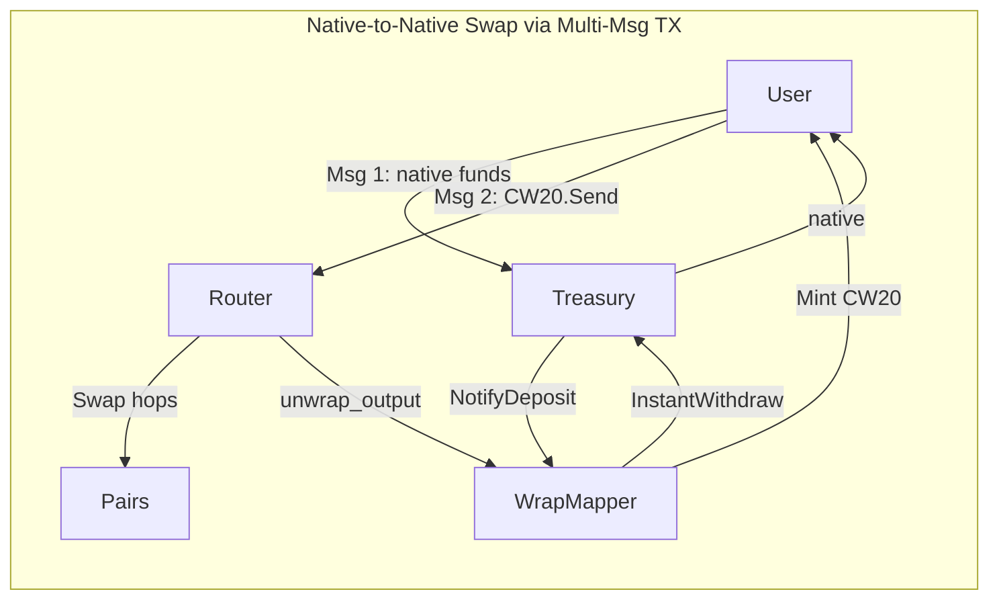

# Native Token Wrapping -- cl8y-dex-terraclassic

Plan to integrate native LUNC/USTC support into the DEX router, frontend, and test suite. Depends on the treasury upgrade and wrap-mapper contract in `ustr-cmm` (see `~/repos/ustr-cmm/NATIVE_TOKEN_WRAPPING.md`).

## Architecture



The router does NOT accept native token input directly. Instead, the frontend builds multi-message transactions:
- **Input wrapping**: Msg 1 = `treasury.WrapDeposit()` (native funds go directly to treasury = 1 tax event), Msg 2 = CW20 send to router.
- **Output unwrapping**: Router sends CW20 to wrap-mapper with `Unwrap { recipient }` (wrap-mapper calls `treasury.InstantWithdraw`, treasury sends native to user = 1 tax event).

This achieves the minimum possible tax: 1 event for wrapping input, 1 event for unwrapping output.

## 1. Modify Router Contract (`smartcontracts/contracts/router/`)

The router only needs `unwrap_output` support for the output side. No native input handling.

### 1.1 Config changes in `src/state.rs`

- Add `WRAP_MAPPER: Item<Option<Addr>>` to store the wrap-mapper address
- Add `unwrap_output: Option<String>` (native denom) to `SwapState`

### 1.2 Message changes in `src/msg.rs`

Add to `ExecuteMsg`:

```rust
SetWrapMapper { wrap_mapper: String }  // governance only via factory
```

Add `unwrap_output: Option<bool>` to both:
- `Cw20HookMsg::ExecuteSwapOperations`
- `ExecuteMsg::ExecuteSwapOperations`

### 1.3 Logic changes in `src/contract.rs`

**`execute` handler**: Add match arm for `SetWrapMapper`. Verify caller is factory or governance. Save to `WRAP_MAPPER`.

**`execute_swap_operations`** (line ~108): If `unwrap_output` is `true`, look up the last operation's `ask_asset_info`, query wrap-mapper for the corresponding native denom, and store `unwrap_output: Some(denom)` in `SwapState`.

**`reply_swap_hop`** (line ~216, final hop branch):
- If `state.unwrap_output` is `Some(_denom)`: load `WRAP_MAPPER`, send CW20 output to wrap-mapper via `CW20.Send` with `Unwrap { recipient: state.recipient.to_string() }` instead of `CW20.Transfer`.
- Otherwise: existing `CW20.Transfer` to recipient (unchanged).

### 1.4 Error changes in `src/error.rs`

Add:

```rust
WrapMapperNotSet {}
UnwrapOutputNotSupported {}
```

### 1.5 Why NOT add native input to router

Sending native to the router then forwarding to treasury = 2 tax events (user->router, router->treasury). The frontend multi-msg TX approach calls `treasury.WrapDeposit()` directly = 1 tax event.

### 1.6 Files modified

- `smartcontracts/contracts/router/src/msg.rs`
- `smartcontracts/contracts/router/src/contract.rs`
- `smartcontracts/contracts/router/src/state.rs`
- `smartcontracts/contracts/router/src/error.rs`

## 2. Add `wrap_mapper` Module to `dex-common` (`smartcontracts/packages/dex-common/`)

Create `src/wrap_mapper.rs` with shared types used by both the router and the frontend:

```rust
pub enum WrapMapperExecuteMsg {
    NotifyDeposit { depositor: String, denom: String, amount: Uint128 },
    Receive(Cw20ReceiveMsg),
    // ... governance messages
}

pub enum WrapMapperCw20HookMsg {
    Unwrap { recipient: Option<String> },
}

pub enum WrapMapperQueryMsg {
    Config {},
    DenomMapping { denom: String },
    AllDenomMappings {},
    RateLimit { denom: String },
}

// Response types
pub struct DenomMappingResponse {
    pub denom: String,
    pub cw20_addr: Addr,
}

pub struct AllDenomMappingsResponse {
    pub mappings: Vec<DenomMappingResponse>,
}

pub struct RateLimitResponse {
    pub config: Option<RateLimitConfig>,
    pub current_usage: Uint128,
    pub window_resets_at: Option<Timestamp>,
}
```

Export from `src/lib.rs`:

```rust
pub mod wrap_mapper;
```

### Files modified

- `smartcontracts/packages/dex-common/src/wrap_mapper.rs` (new)
- `smartcontracts/packages/dex-common/src/lib.rs`

## 3. Workspace Changes

In `smartcontracts/Cargo.toml`, no new workspace members needed (wrap-mapper lives in ustr-cmm). The `treasury` workspace dependency already points to the ustr-cmm repo.

## 4. Frontend: Token Registry and Constants

### 4.1 `frontend-dapp/src/utils/constants.ts`

Add:

```typescript
export const WRAP_MAPPER_CONTRACT_ADDRESS = import.meta.env.VITE_WRAP_MAPPER_ADDRESS || ''
export const TREASURY_CONTRACT_ADDRESS = import.meta.env.VITE_TREASURY_ADDRESS || ''
export const LUNC_C_TOKEN_ADDRESS = import.meta.env.VITE_LUNC_C_TOKEN_ADDRESS || ''
export const USTC_C_TOKEN_ADDRESS = import.meta.env.VITE_USTC_C_TOKEN_ADDRESS || ''

export const NATIVE_WRAPPED_PAIRS: Record<string, string> = {
  uluna: LUNC_C_TOKEN_ADDRESS,
  uusd: USTC_C_TOKEN_ADDRESS,
}

export const WRAPPED_NATIVE_PAIRS: Record<string, string> = {
  [LUNC_C_TOKEN_ADDRESS]: 'uluna',
  [USTC_C_TOKEN_ADDRESS]: 'uusd',
}
```

### 4.2 `frontend-dapp/src/utils/tokenRegistry.ts`

Add to `TOKENS` array:

```typescript
{
  symbol: 'LUNC-C',
  name: 'Wrapped Luna Classic',
  decimals: 6,
  type: 'cw20',
  logoURI: '...',
},
{
  symbol: 'USTC-C',
  name: 'Wrapped TerraClassicUSD',
  decimals: 6,
  type: 'cw20',
  logoURI: '...',
},
```

Add CW20 addresses to `CW20_MAP`.

## 5. Frontend: New `wrapMapper.ts` Service

Create `frontend-dapp/src/services/terraclassic/wrapMapper.ts`:

- `wrapViaTreasury(walletAddress, denom, amount)` -- builds msg for `treasury.WrapDeposit()` with native funds attached via `coins` parameter
- `unwrap(walletAddress, cw20Address, amount, recipient?)` -- builds CW20 Send to wrap-mapper with `{ unwrap: { recipient } }`
- `queryDenomMapping(denom)` -- queries wrap-mapper for CW20 address
- `queryRateLimit(denom)` -- queries wrap-mapper for rate limit config and current usage
- `isNativeWrappedPair(tokenA, tokenB)` -- returns true if one is a native denom and the other is its CW20 counterpart (uses `NATIVE_WRAPPED_PAIRS` constant)
- `getWrappedForNative(denom)` -- returns CW20 address from `NATIVE_WRAPPED_PAIRS`
- `getNativeForWrapped(cw20Addr)` -- returns denom from `WRAPPED_NATIVE_PAIRS`
- `isNativeToken(tokenId)` -- returns true for `uluna`, `uusd`
- `isWrappedNative(tokenId)` -- returns true for LUNC-C/USTC-C addresses

## 6. Frontend: Multi-Message Transaction Support

Enhance `frontend-dapp/src/services/terraclassic/transactions.ts`:

Add `executeTerraContractMulti`:

```typescript
export async function executeTerraContractMulti(
  walletAddress: string,
  messages: Array<{
    contract: string
    msg: Record<string, unknown>
    coins?: Array<{ denom: string; amount: string }>
  }>
): Promise<string>
```

Builds a single TX with multiple `MsgExecuteContract` messages. Gas estimation sums per-message estimates. Used for:
- Wrap-then-swap (msg 1 = WrapDeposit, msg 2 = CW20 send to router)
- Wrap-then-provide-liquidity (msg 1 = WrapDeposit, msg 2+ = allowance + provide)

Add gas constants:

```typescript
const WRAP_GAS_LIMIT = 300000
const UNWRAP_GAS_LIMIT = 400000
```

## 7. Frontend: Swap Routing Changes

Modify `frontend-dapp/src/services/terraclassic/router.ts`:

### 7.1 Direct wrap/unwrap detection

Add `isDirectWrapUnwrap(from, to)`:
- Returns `'wrap'` if `from` is native and `to` is its CW20 counterpart
- Returns `'unwrap'` if `from` is CW20 and `to` is its native counterpart
- Returns `null` otherwise

When detected, the swap page should call wrap or unwrap directly (no DEX routing needed).

### 7.2 Route finding with native tokens

Modify `findRoute()`:
- If `fromToken` is a native denom (e.g. `uluna`), substitute its wrapped CW20 address for graph traversal
- If `toToken` is a native denom, substitute its wrapped CW20 address for graph traversal
- Return the route using CW20 addresses (the frontend wraps/unwraps around it)

### 7.3 Native swap execution

Add `executeNativeSwap()` helper that:
1. If input is native: build multi-msg TX with `treasury.WrapDeposit()` as msg 1, CW20 send to router as msg 2
2. If output should be native: set `unwrap_output: true` in the CW20 hook message to the router
3. If both: combine both behaviors

### 7.4 Simulation

Add `simulateNativeSwap()`:
- Substitutes native denom with wrapped CW20 for the simulation query
- Returns 1:1 rate for the wrap/unwrap portion

For direct wrap/unwrap (LUNC<->LUNC-C), return 1:1 rate with a note about burn tax.

## 8. Frontend: Swap UI Changes (`frontend-dapp/src/pages/SwapPage.tsx`)

### 8.1 Token selector

Modify `getAllTokens(pairs)` call site to append native LUNC (`uluna`) and USTC (`uusd`) entries so users can select them alongside CW20 tokens. The selector should show:
- LUNC (native)
- LUNC-C (wrapped CW20)
- USTC (native)
- USTC-C (wrapped CW20)
- ... other CW20 tokens

### 8.2 Swap flow branching

After user selects tokens and enters amount, determine the swap type:

1. **Direct wrap/unwrap** (e.g. LUNC -> LUNC-C): call `wrapViaTreasury()` or `unwrap()` directly. Show "Wrap" or "Unwrap" on button instead of "Swap".
2. **Native input, CW20 output**: multi-msg TX via `executeNativeSwap()`.
3. **CW20 input, native output**: single TX with `unwrap_output: true`.
4. **Native input, native output**: multi-msg wrap + swap with `unwrap_output: true`.
5. **CW20 to CW20**: existing swap flow (no change).

### 8.3 Simulation display

- For direct wrap/unwrap: show "1:1" rate with burn tax note (e.g. "~0.2% burn tax on unwrap").
- For swaps involving native tokens: simulate using wrapped CW20 equivalent, display normally.

## 9. Frontend: Pool UI Changes (`frontend-dapp/src/pages/PoolPage.tsx`)

### 9.1 Provide Liquidity

For each asset in a pair that has a native equivalent (e.g. a pair containing LUNC-C):

- Show a dropdown next to the amount input: "LUNC" / "LUNC-C" (default: "LUNC", the native version).
- If native selected: build multi-msg TX:
  1. `treasury.WrapDeposit()` with native funds (mints CW20 to user)
  2. `CW20.IncreaseAllowance` for the pair contract
  3. `pair.ProvideLiquidity` with CW20 assets
- If wrapped selected: existing flow (CW20 allowance + provide).
- Amounts are known exactly since wrapping is 1:1.

### 9.2 Withdraw Liquidity

Add a visible checkbox below the withdraw section:
- Label: **"Receive wrapped {SYMBOL}-C"** (e.g. "Receive wrapped LUNC-C")
- Default: **unchecked** (user receives native by default)

Behavior:
- **Unchecked** (receive native): two-step flow:
  1. Withdraw liquidity (user receives CW20 tokens)
  2. Auto-prompt: "Unwrap {amount} LUNC-C to LUNC?" with a confirmation button
  3. On confirm: send CW20 to wrap-mapper with Unwrap
- **Checked** (receive wrapped): existing single-step withdraw, no unwrap.

Only show the checkbox for pairs that contain wrapped native tokens (LUNC-C or USTC-C).

## 10. Frontend: Types Changes (`frontend-dapp/src/types/index.ts`)

Add helper types and functions:

```typescript
export function isNativeDenom(tokenId: string): boolean
export function getWrappedEquivalent(tokenId: string): string | null
export function getNativeEquivalent(tokenId: string): string | null
```

---

## Test Plan

### A. Router Contract Tests (in `smartcontracts/tests/src/lib.rs`)

Extend the existing test suite. Add a `wrap_mapper_contract()` helper to the helpers module.

| # | Test | Validates |
|---|------|-----------|
| A1 | `test_set_wrap_mapper` | Governance can set wrap_mapper; non-governance rejected |
| A2 | `test_swap_with_unwrap_output_true` | Final hop sends CW20 to wrap-mapper via Send with Unwrap msg |
| A3 | `test_swap_with_unwrap_output_false` | Existing behavior: CW20 Transfer to recipient |
| A4 | `test_swap_unwrap_output_default_none` | Backwards compatible: omitting field = no unwrap |
| A5 | `test_multihop_with_unwrap_output` | Multi-hop swap unwraps final output correctly |
| A6 | `test_unwrap_output_no_wrap_mapper_set` | Error when unwrap_output=true but no wrap_mapper configured |
| A7 | `test_unwrap_output_minimum_receive` | minimum_receive still enforced before unwrap |

### B. Integration Tests (in `smartcontracts/tests/src/lib.rs`)

Full end-to-end flows deploying all contracts (factory, pair, router, wrap-mapper, CW20 tokens, treasury).

| # | Test | Validates |
|---|------|-----------|
| B1 | `test_wrap_native_to_cw20` | User wraps LUNC via treasury.WrapDeposit -> gets LUNC-C |
| B2 | `test_unwrap_cw20_to_native` | User unwraps LUNC-C -> gets native LUNC from treasury |
| B3 | `test_wrap_unwrap_roundtrip` | Wrap then unwrap: user balance correct, treasury balance correct |
| B4 | `test_swap_native_input_cw20_output` | Multi-msg: treasury.WrapDeposit + CW20.Send to router -> swap completes |
| B5 | `test_swap_cw20_input_native_output` | CW20 swap with unwrap_output=true -> user gets native from treasury |
| B6 | `test_swap_native_to_native` | Full native-to-native: wrap LUNC -> swap -> unwrap to USTC |
| B7 | `test_direct_wrap_lunc_to_lunc_c` | Direct LUNC->LUNC-C (no swap, just wrap) |
| B8 | `test_direct_unwrap_lunc_c_to_lunc` | Direct LUNC-C->LUNC (no swap, just unwrap) |
| B9 | `test_provide_liquidity_with_native` | Wrap + provide_liquidity in sequence |
| B10 | `test_withdraw_liquidity_then_unwrap` | Withdraw CW20, then unwrap to native |
| B11 | `test_rate_limit_blocks_large_wrap` | Wrap exceeding rate limit fails mid-flow |
| B12 | `test_treasury_balance_audit` | After wraps/unwraps, treasury native balance == total CW20 supply |

### C. Security Tests (in `smartcontracts/tests/src/lib.rs`)

| # | Test | Validates |
|---|------|-----------|
| C1 | `test_fake_notify_deposit` | Non-treasury caller can't mint CW20 via NotifyDeposit |
| C2 | `test_fake_instant_withdraw` | Non-wrapper caller can't drain treasury via InstantWithdraw |
| C3 | `test_wrap_wrong_denom` | Wrapping unsupported denom fails |
| C4 | `test_unwrap_wrong_cw20` | Sending unregistered CW20 to wrap-mapper fails |
| C5 | `test_rate_limit_sybil` | Multiple users collectively blocked by global rate limit |
| C6 | `test_wrap_mapper_reentrancy` | Wrap-mapper can't be re-entered during unwrap |
| C7 | `test_treasury_invariant` | After any sequence of wraps/unwraps, treasury balance >= total CW20 supply |
| C8 | `test_governance_only_rate_limit_change` | Only governance can modify rate limits |
| C9 | `test_paused_state_persists` | Pause survives across blocks |

### D. Frontend Unit Tests

| # | Test | Validates |
|---|------|-----------|
| D1 | `isDirectWrapUnwrap` | Returns `'wrap'` for LUNC/LUNC-C, `'unwrap'` for LUNC-C/LUNC, `null` otherwise |
| D2 | `findRoute-native-substitution` | Route found when user selects native token (substitutes wrapped for graph search) |
| D3 | `getWrappedForNative` | Correct CW20 address returned for `uluna` and `uusd` |
| D4 | `getNativeForWrapped` | Correct denom returned for LUNC-C and USTC-C addresses |
| D5 | `executeTerraContractMulti` | Builds TX with multiple MsgExecuteContract messages correctly |
| D6 | `gas-estimation` | Correct gas for wrap, unwrap, wrap+swap, and swap+unwrap operations |
| D7 | `isNativeDenom` | Returns true for `uluna`/`uusd`, false for CW20 addresses |
| D8 | `isWrappedNative` | Returns true for LUNC-C/USTC-C addresses, false for other CW20s |

### E. Frontend E2E Tests (Playwright, in `frontend-dapp/e2e/`)

Using 20+ worker agents.

| # | Test | Validates |
|---|------|-----------|
| E1 | `swap-native-input` | Select native LUNC as input, swap to CW20 token, TX succeeds |
| E2 | `swap-native-output` | Select native USTC as output, swap from CW20, receive native |
| E3 | `swap-native-to-native` | LUNC -> USTC swap, both native, full wrap+swap+unwrap |
| E4 | `swap-direct-wrap` | LUNC -> LUNC-C: shows 1:1 rate, button says "Wrap", executes wrap only |
| E5 | `swap-direct-unwrap` | LUNC-C -> LUNC: shows 1:1 rate + tax note, button says "Unwrap", executes unwrap only |
| E6 | `swap-wrapped-to-wrapped` | LUNC-C -> USTC-C: normal CW20 swap (no wrap/unwrap involved) |
| E7 | `pool-deposit-native` | Select native in dropdown, provide liquidity succeeds via multi-msg |
| E8 | `pool-deposit-wrapped` | Select wrapped in dropdown, provide liquidity succeeds (existing flow) |
| E9 | `pool-withdraw-native` | Withdraw with "Receive wrapped" unchecked, auto-prompt unwrap, receive native |
| E10 | `pool-withdraw-wrapped` | Withdraw with "Receive wrapped" checked, receive CW20 directly |
| E11 | `token-selector-shows-both` | Token selector displays both LUNC and LUNC-C, USTC and USTC-C |
| E12 | `rate-limit-error-display` | When rate limit exceeded, user sees descriptive error message |
