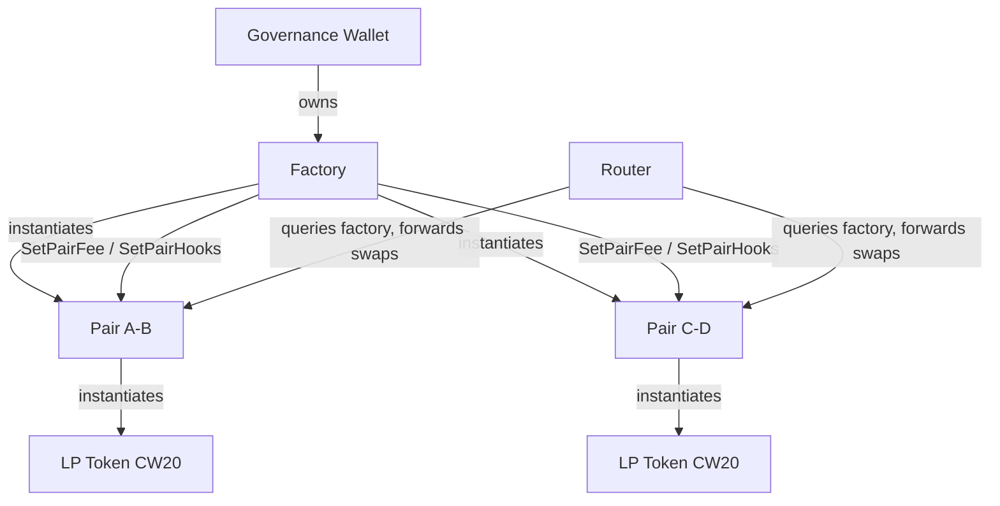
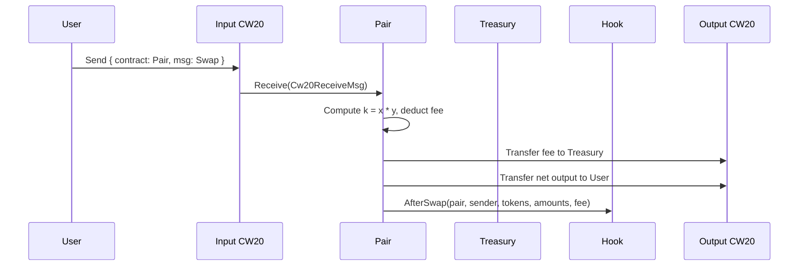

# Architecture Overview

CL8Y DEX is a constant-product AMM deployed on Terra Classic. The system comprises three core contracts — Factory, Pair, and Router — plus an extensible hook interface.

## Contract Relationships



## Swap Flow



## Key Design Decisions

- **Constant product (x * y = k):** simple, battle-tested AMM invariant.
- **Fee-on-output:** fee is taken from the computed output amount, not the input.
- **Factory-gated governance:** only the Factory can update pair fees and hooks, keeping governance centralized at one address.
- **Code ID whitelist:** the Factory validates that both tokens in a pair were instantiated from whitelisted CW20 code IDs, preventing malicious token contracts.
- **Hook system:** post-swap hooks allow composable integrations (analytics, rewards, etc.) without modifying the core pair logic.

## Directory Layout

```
smartcontracts/
├── contracts/
│   ├── factory/    # Pair registry, governance, code ID whitelist
│   ├── pair/       # AMM logic, LP minting/burning, fee management
│   ├── router/     # Multi-hop routing (single-hop in v1)
│   └── hooks/      # Example hook contracts
├── packages/
│   └── dex-common/ # Shared types, messages, pagination
└── tests/          # Integration test harness
```
