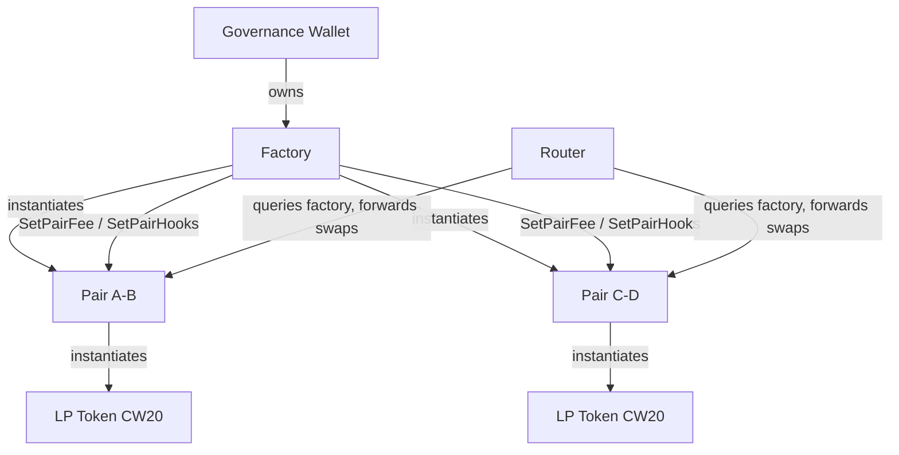
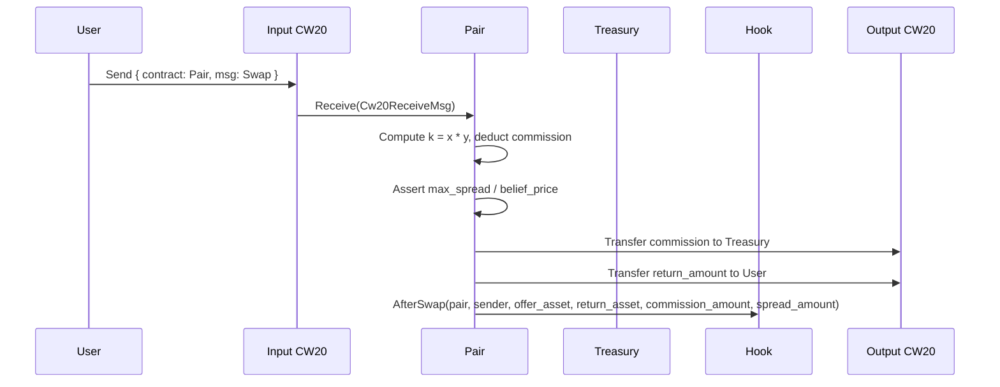

# Architecture Overview

CL8Y DEX is a constant-product AMM deployed on Terra Classic. The system comprises three core contracts — Factory, Pair, and Router — plus an extensible hook interface. On-chain message and event formats are TerraSwap/Terraport-compatible for Vyntrex integration.

## Contract Relationships



## Swap Flow



## TerraSwap Compatibility

Messages, queries, and events use TerraSwap field names so Vyntrex can parse our contracts without custom code:

- **AssetInfo enum:** `{ "token": { "contract_addr": "..." } }` or `{ "native_token": { "denom": "..." } }` (native rejected at runtime)
- **Swap events:** emit `offer_asset`, `ask_asset`, `offer_amount`, `return_amount`, `spread_amount`, `commission_amount`
- **Router:** uses `SwapOperation` enum with `TerraSwap` and `NativeSwap` variants (native rejected at runtime)
- **Queries:** `Config`, `Pair`, `Pairs`, `Pool`, `Simulation`, `ReverseSimulation`

Our extensions (governance, treasury, FeeConfig, code ID whitelist, post-swap hooks) are additive and don't conflict with the TerraSwap interface.

## Key Design Decisions

- **Constant product (x * y = k):** simple, battle-tested AMM invariant.
- **Fee-on-output:** fee (commission) is taken from the computed output amount, not the input.
- **belief_price / max_spread:** TerraSwap-compatible slippage protection replaces `min_output`.
- **Factory-gated governance:** only the Factory can update pair fees and hooks, keeping governance centralized at one address.
- **Code ID whitelist:** the Factory validates that both tokens in a pair were instantiated from whitelisted CW20 code IDs, preventing malicious token contracts.
- **Hook system:** post-swap hooks allow composable integrations (burn, tax, LP-burn) without modifying the core pair logic.
- **CW20-only:** native tokens are accepted in the type system for TerraSwap wire compatibility but rejected at runtime. Future support will use CW20 wrapping.

## Directory Layout

```
smartcontracts/
├── contracts/
│   ├── factory/    # Pair registry, governance, code ID whitelist
│   ├── pair/       # AMM logic, LP minting/burning, fee management
│   ├── router/     # Multi-hop routing via SwapOperation
│   └── hooks/      # Post-swap hook contracts (burn, tax, lp-burn)
├── packages/
│   └── dex-common/ # Shared types (AssetInfo, Asset, PairInfo), messages, pagination
└── tests/          # Integration test harness
```
