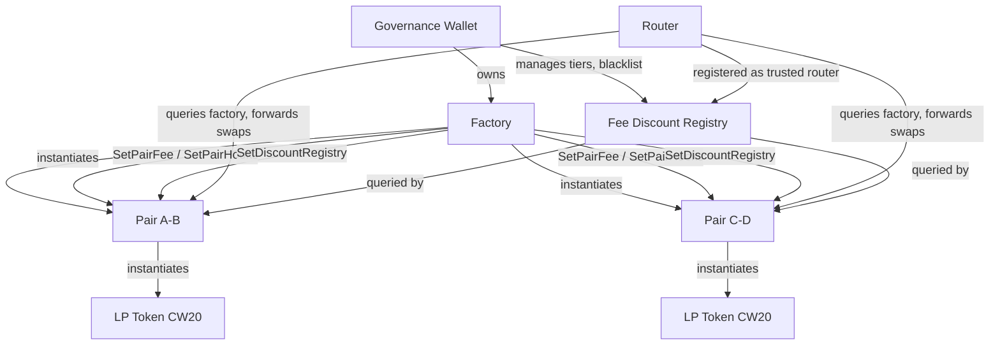
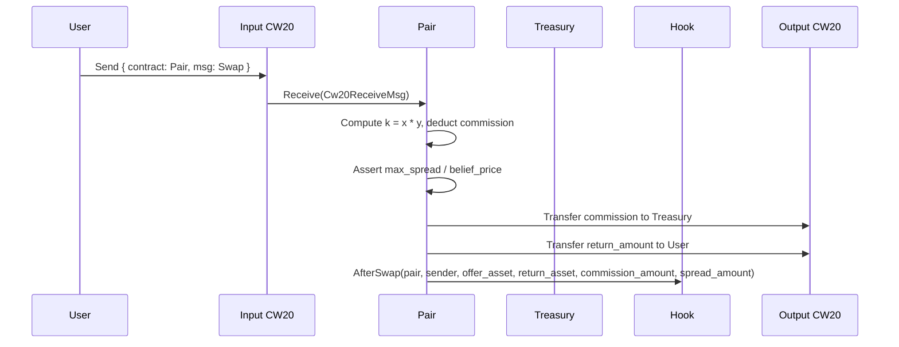
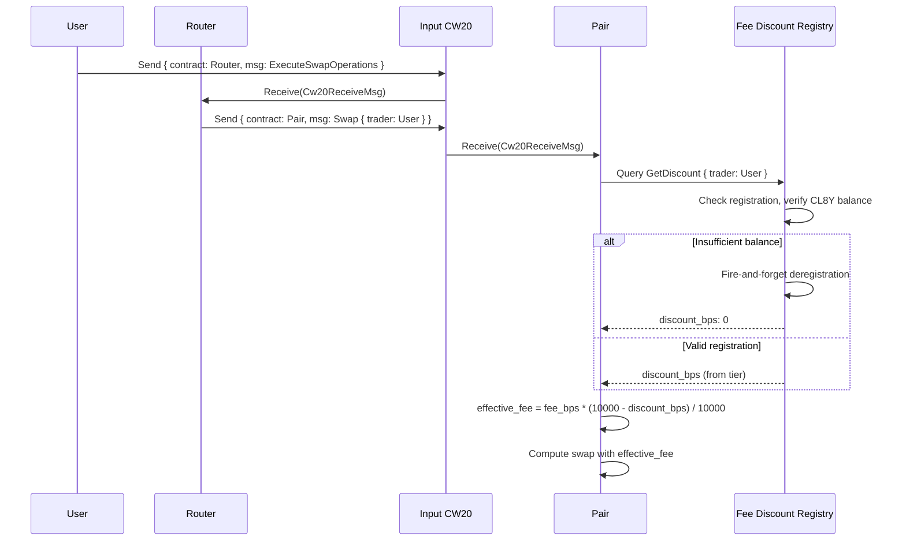

# Architecture Overview

CL8Y DEX is a constant-product AMM deployed on Terra Classic. The system comprises four core contracts — Factory, Pair, Router, and Fee Discount — plus an extensible hook interface. On-chain message and event formats are TerraSwap/Terraport-compatible for Vyntrex integration.

## Contract Relationships



## Swap Flow



## Fee Discount Flow

When a pair has a discount registry configured, the swap path includes a discount lookup:



The Router passes the original trader's address through the `trader` field on `Cw20HookMsg::Swap` so the Pair can look up the correct discount. Direct swaps (without the Router) can also receive discounts — the Pair uses `info.sender` as the trader when the `trader` field is omitted.

### Discount Tiers

Governance defines tiers on the fee-discount contract (CL8Y balance thresholds and `discount_bps`). Tier **0** (100% discount) and **255** (blacklist) are governance-only; self-service tiers **1–9** use increasing CL8Y minimums. The **authoritative** ladder, `min_cl8y_balance` wire values, and example `terrad` JSON are in **[`docs/reference/fee-discount-tiers.md`](reference/fee-discount-tiers.md)** (aligned with integration tests in `smartcontracts/tests/src/tier_fixtures.rs`).

CL8Y token balances are checked on every swap. If a trader's balance falls below their tier's threshold, the fee-discount contract fires a deregistration message and returns zero discount for that swap.

## TerraSwap Compatibility

Messages, queries, and events use TerraSwap field names so Vyntrex can parse our contracts without custom code:

- **AssetInfo enum:** `{ "token": { "contract_addr": "..." } }` or `{ "native_token": { "denom": "..." } }` (native rejected at runtime)
- **Swap events:** emit `offer_asset`, `ask_asset`, `offer_amount`, `return_amount`, `spread_amount`, `commission_amount`
- **Router:** uses `SwapOperation` enum with `TerraSwap` and `NativeSwap` variants (native rejected at runtime)
- **Queries:** `Config`, `Pair`, `Pairs`, `Pool`, `Simulation`, `ReverseSimulation`

Our extensions (governance, treasury, FeeConfig, code ID whitelist, post-swap hooks) are additive and don't conflict with the TerraSwap interface.

## Key Design Decisions

- **Constant product (x * y = k):** simple, battle-tested AMM invariant.
- **Fee-on-output:** fee (commission) is taken from the computed output amount, not the input.
- **belief_price / max_spread:** TerraSwap-compatible slippage protection replaces `min_output`.
- **Factory-gated governance:** only the Factory can update pair fees and hooks, keeping governance centralized at one address.
- **Code ID whitelist:** the Factory validates that both tokens in a pair were instantiated from whitelisted CW20 code IDs, preventing malicious token contracts.
- **Hook system:** post-swap hooks allow composable integrations (burn, tax, LP-burn) without modifying the core pair logic.
- **Fee discount registry:** a separate contract manages tiered fee discounts. Pairs query it during swaps, keeping discount logic decoupled from the AMM core. Balance verification on every swap ensures discounts cannot persist after tokens are moved.
- **CW20-only:** native tokens are accepted in the type system for TerraSwap wire compatibility but rejected at runtime. Future support will use CW20 wrapping.

## Limit orders (hybrid AMM + book)

FIFO limit book, Pattern C splits, and indexer route solving are documented in [limit-orders.md](./limit-orders.md). Types and caps are in `dex-common` (`HybridSwapParams`, `PlaceLimitOrder`, `CancelLimitOrder`).

## Directory Layout

```
smartcontracts/
├── contracts/
│   ├── factory/       # Pair registry, governance, code ID whitelist
│   ├── pair/          # AMM logic, LP minting/burning, fee management
│   ├── router/        # Multi-hop routing via SwapOperation
│   ├── fee-discount/  # Tiered fee discount registry for CL8Y holders
│   └── hooks/         # Post-swap hook contracts (burn, tax, lp-burn)
├── packages/
│   └── dex-common/ # Shared types (AssetInfo, Asset, PairInfo), messages, pagination
└── tests/          # Integration test harness
```
