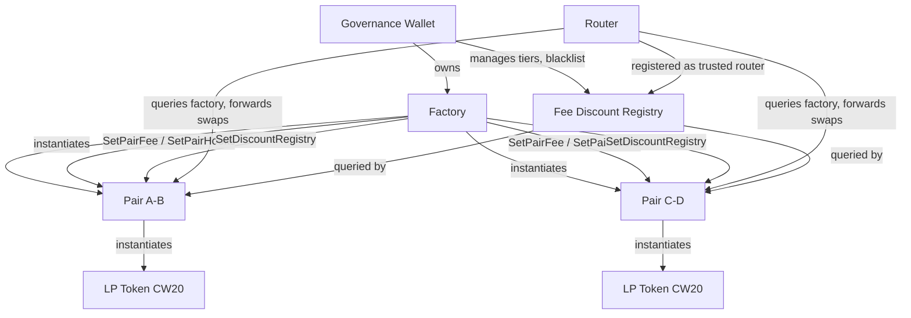
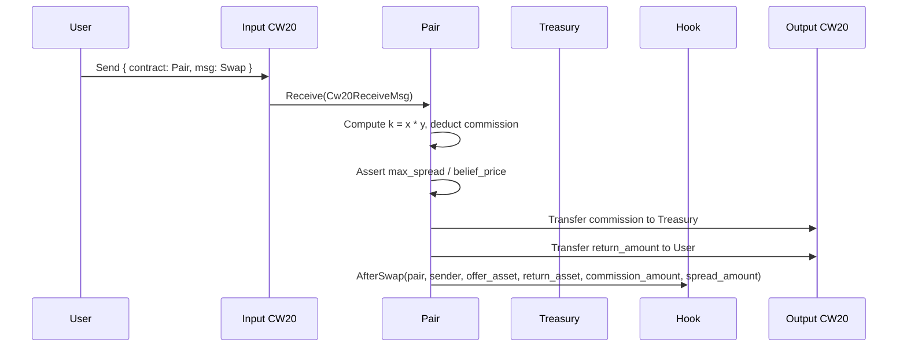
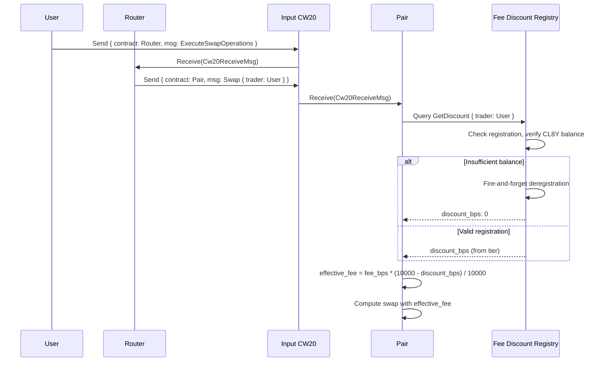
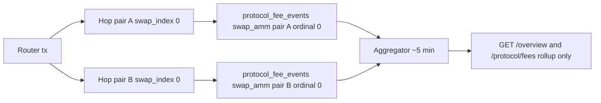

# Architecture Overview

CL8Y DEX is a constant-product AMM deployed on Terra Classic. The system comprises four core contracts — Factory, Pair, Router, and Fee Discount — plus an extensible hook interface. On-chain message and event formats are TerraSwap/Terraport-compatible for Vyntrex integration.

## Contract Relationships


```mermaid
graph TD
    GOV[Governance Wallet] -->|owns| FACTORY[Factory]
    FACTORY -->|instantiates| PAIR1[Pair A-B]
    FACTORY -->|instantiates| PAIR2[Pair C-D]
    PAIR1 -->|instantiates| LP1[LP Token CW20]
    PAIR2 -->|instantiates| LP2[LP Token CW20]
    FACTORY -->|SetPairFee / SetPairHooks| PAIR1
    FACTORY -->|SetPairFee / SetPairHooks| PAIR2
    FACTORY -->|SetDiscountRegistry| PAIR1
    FACTORY -->|SetDiscountRegistry| PAIR2
    ROUTER[Router] -->|queries factory, forwards swaps| PAIR1
    ROUTER -->|queries factory, forwards swaps| PAIR2
    DISCOUNT[Fee Discount Registry] -->|queried by| PAIR1
    DISCOUNT -->|queried by| PAIR2
    GOV -->|manages tiers, blacklist| DISCOUNT
    ROUTER -->|registered as trusted router| DISCOUNT
```

## Swap Flow


```mermaid
sequenceDiagram
    participant User
    participant CW20 as Input CW20
    participant Pair
    participant Treasury
    participant Hook
    participant OutCW20 as Output CW20

    User->>CW20: Send { contract: Pair, msg: Swap }
    CW20->>Pair: Receive(Cw20ReceiveMsg)
    Pair->>Pair: Compute k = x * y, deduct commission
    Pair->>Pair: Assert max_spread / belief_price
    Pair->>OutCW20: Transfer commission to Treasury
    Pair->>OutCW20: Transfer return_amount to User
    Pair->>Hook: AfterSwap(pair, sender, offer_asset, return_asset, commission_amount, spread_amount)
```

## Fee Discount Flow

When a pair has a discount registry configured, the swap path includes a discount lookup:


```mermaid
sequenceDiagram
    participant User
    participant Router
    participant CW20 as Input CW20
    participant Pair
    participant FeeDiscount as Fee Discount Registry

    User->>CW20: Send { contract: Router, msg: ExecuteSwapOperations }
    CW20->>Router: Receive(Cw20ReceiveMsg)
    Router->>CW20: Send { contract: Pair, msg: Swap { trader: User } }
    CW20->>Pair: Receive(Cw20ReceiveMsg)
    Pair->>FeeDiscount: Query GetDiscount { trader: User }
    FeeDiscount->>FeeDiscount: Check registration, verify CL8Y balance
    alt Insufficient balance
        FeeDiscount->>FeeDiscount: Fire-and-forget deregistration
        FeeDiscount-->>Pair: discount_bps: 0
    else Valid registration
        FeeDiscount-->>Pair: discount_bps (from tier)
    end
    Pair->>Pair: effective_fee = fee_bps * (10000 - discount_bps) / 10000
    Pair->>Pair: Compute swap with effective_fee
```

The Router passes the original trader's address through the `trader` field on `Cw20HookMsg::Swap` so the Pair can look up the correct discount. Direct swaps (without the Router) can also receive discounts — the Pair uses `info.sender` as the trader when the `trader` field is omitted.

### Discount Tiers

Governance defines tiers on the fee-discount contract (CL8Y balance thresholds and `discount_bps`). Tier **0** (100% discount) and **255** (blacklist) are governance-only; self-service tiers **1–9** use increasing CL8Y minimums. The **authoritative** ladder, `min_cl8y_balance` wire values, invariants, and example `terrad` JSON are only in **[`docs/reference/fee-discount-tiers.md`](reference/fee-discount-tiers.md)** ([GitLab #198](https://gitlab.com/PlasticDigits/cl8y-dex-terraclassic/-/issues/198)) — aligned with `smartcontracts/tests/src/tier_fixtures.rs` and verified by `make check-fee-discount-tier-docs`. Agent playbook: [`skills/AGENTS_FEE_DISCOUNT_TIERS.md`](../skills/AGENTS_FEE_DISCOUNT_TIERS.md).

CL8Y token balances are checked on every swap. If a trader's balance falls below their tier's threshold, the fee-discount contract fires a deregistration message and returns zero discount for that swap.

## TerraSwap Compatibility

Messages, queries, and events use TerraSwap field names so Vyntrex can parse our contracts without custom code:

- **AssetInfo enum:** `{ "token": { "contract_addr": "..." } }` or `{ "native_token": { "denom": "..." } }` (native rejected at runtime)
- **Swap events:** emit `offer_asset`, `ask_asset`, `offer_amount`, `return_amount`, `spread_amount`, `commission_amount`
- **Router:** uses `SwapOperation` enum with `TerraSwap` and `NativeSwap` variants (native rejected at runtime)
- **Queries:** `Config`, `Pair`, `Pairs`, `Pool`, `HybridSimulation`, `HybridReverseSimulation` (legacy `Simulation` removed — [#190](https://gitlab.com/PlasticDigits/cl8y-dex-terraclassic/-/issues/190))

Our extensions (governance, treasury, FeeConfig, code ID whitelist, post-swap hooks) are additive and don't conflict with the TerraSwap interface.

## Key Design Decisions

- **Constant product (x * y = k):** simple, battle-tested AMM invariant.
- **Fee-on-output:** fee (commission) is taken from the computed output amount, not the input.
- **belief_price / max_spread:** TerraSwap-compatible slippage protection replaces `min_output`.
- **Factory-gated governance:** only the Factory can update pair fees and hooks, keeping governance centralized at one address.
- **Code ID whitelist:** the Factory validates that both tokens in a pair were instantiated from whitelisted CW20 code IDs, preventing malicious token contracts.
- **Hook system:** post-swap hooks allow composable integrations (burn, tax, LP-burn) without modifying the core pair logic.
- **Fee discount registry:** a separate contract manages tiered fee discounts. Pairs query it during swaps, keeping discount logic decoupled from the AMM core. Balance verification on every swap ensures discounts cannot persist after tokens are moved.
- **CW20-only:** native tokens are accepted in the type system for TerraSwap wire compatibility but rejected at runtime. Future support will use CW20 wrapping.

## Limit orders (hybrid AMM + book)

FIFO limit book, Pattern C splits, and indexer route solving are documented in [limit-orders.md](./limit-orders.md). Types and caps are in `dex-common` (`HybridSwapParams`, `PlaceLimitOrder`, `CancelLimitOrder`).

## Indexer protocol fee ledger

The indexer persists treasury-bound fees in `protocol_fee_events` (census [#586](https://gitlab.com/PlasticDigits/cl8y-dex-terraclassic/-/issues/586)). Router swaps emit one wasm `action=swap` + `commission_amount` **per hop** under a single `txhash`. `parse_swaps` assigns `swap_index` **per pair** (restarts at 0 on the next pair — [#287](https://gitlab.com/PlasticDigits/cl8y-dex-terraclassic/-/issues/287)). Volume rows already use `(tx_hash, pair_id, swap_index)`. Fee uniqueness must match that shape or later hops collide.


```mermaid
flowchart LR
    TX[Router tx] --> H1[Hop pair A swap_index 0]
    TX --> H2[Hop pair B swap_index 0]
    H1 --> FE1["protocol_fee_events swap_amm pair A ordinal 0"]
    H2 --> FE2["protocol_fee_events swap_amm pair B ordinal 0"]
    FE1 --> ROLL[Aggregator ~5 min]
    FE2 --> ROLL
    ROLL --> GET["GET /overview and /protocol/fees rollup only"]
```

| Source | `pair_id` | Unique |
|--------|-----------|--------|
| `swap_amm` | factory `pairs.id` | `protocol_fee_events_pair_tx_source_ordinal_uidx` `(tx_hash, source, pair_id, ordinal)` WHERE `pair_id IS NOT NULL` |
| wrap / unwrap / ust1_* / book_take / limit_place | NULL | `protocol_fee_events_nopair_tx_source_ordinal_uidx` `(tx_hash, source, ordinal)` WHERE `pair_id IS NULL` |

Replay is `ON CONFLICT DO NOTHING` (never overwrite). Missing hops are backfilled from `swap_events.commission_amount`; GET never `SUM`s the event table. Decision, alternatives, sqlx-version leftover, rollout, and rollback: [ADR 0005](./adr/0005-protocol-fee-multihop-hops.md) ([#1269](https://git.cl8y.com/code/cl8y-dex-terraclassic/issues/1269) / [PR #1274](https://git.cl8y.com/code/cl8y-dex-terraclassic/pulls/1274)). Invariants: [`indexer-invariants.md`](./indexer-invariants.md) **Protocol fees (#586 / #1269)**. Playbook: [`AGENTS_INDEXER_PROTOCOL_FEE_HOPS.md`](../skills/AGENTS_INDEXER_PROTOCOL_FEE_HOPS.md).

## Indexer production attest {#indexer-production-attest}

Shipped in the code MR ([ADR 0006](./adr/0006-indexer-health-git-sha.md) / [#1276](https://git.cl8y.com/code/cl8y-dex-terraclassic/issues/1276)). [`indexer/src/api/mod.rs`](../indexer/src/api/mod.rs) `health()` is liveness `{"status":"ok"}` plus optional `"git_sha"`; [`docker/indexer/Dockerfile`](../docker/indexer/Dockerfile) bakes `GIT_SHA` / `SOURCE_COMMIT` on the **runtime** stage after `COPY --from=builder`. Live leftover (Coolify checkbox + `VERIFY1276_EXPECT_SHA` tip-match) stays operator / #297.

Two Coolify apps share this Forgejo repo: **frontend** (`dex.cl8y.com`, auto-deploy on) and **indexer** (`indexer.dex.cl8y.com`, [`docker/indexer/Dockerfile`](../docker/indexer/Dockerfile)). CAC grouped drain maps **one** UUID per `owner/repo` and is not the indexer redeploy path. Product attest is indexer `GET /health`: always `{"status":"ok"}`, plus optional `"git_sha"` when baked `GIT_SHA` (only if **non-empty after trim**) or else `SOURCE_COMMIT` parses as lowercase hex 7–40. Empty or whitespace-only `GIT_SHA` (Dockerfile ARG default `""`) **falls through** to `SOURCE_COMMIT`; a non-empty reject (`HEAD`, `main` / `refs/heads/main`, secrets) does not. Never copy Coolify `HEAD`/branch into `GIT_SHA`. ARG/ENV are re-declared on the **runtime** stage **after** `COPY --from=builder`, not immediately after `FROM` and not on the builder. Handler reads env per request. CAC `/health` stays SHA-free. Fee-discount health stays LCD-only.

Auto-deploy on the indexer app is an operator Coolify protected-branch flag (leftover, [agent-control #297](https://git.cl8y.com/PlasticDigits/cl8y-agent-control/issues/297)). Do not infer that checkbox from HTTP. Issue AC maps as in ADR 0006 Outcome: keep the checkbox; strengthen “matching the baked commit” to `VERIFY1276_EXPECT_SHA` prefix-match of the serving merge; leftover does **not** HTTP-attest the Vite app (frontend has no public SHA; dual-app skew is expected). Leftover-complete is indexer tip-match + checkbox.

Sibling leftover scripts (`VERIFY*_IID`) fail-close on **unreachable**; #1276 **adds** `EXPECT_SHA` under IID/`LEFTOVER_COMPLETE` (bare IID without `EXPECT_SHA` is an intentional FAIL before curl, not a #701 bug). Probe: `VERIFY1276_REQUIRE_LIVE=1` without IID and without `EXPECT_SHA` may PASS bake presence. Leave watch paths off until leftover is closed if glance uses repo `HEAD`. Boot still runs `sqlx::migrate!()` (no production `set_ignore_missing`). Unique `YYYYMMDDHHMMSS` prefixes required; colliding same-timestamp files keep the **first-applied** checksum (`20260916120000_usdt_quote_usd_null_backfill.sql`) and bump the later sibling. Coolify-era indexer rollback is **three-way** (**H1276-7**): **2(a)** unchanged vs prior Coolify Deploys SHA (`git ls-tree --name-only <sha> indexer/migrations/`) → restore; **2(b)** keep schema + hotfix that still ships N **even if** a paired `down.sql` exists — **no Stop** only for clean ahead; when `idx_reclass` is **2(b)**, **start only the hotfix image**; dirty → **2(a)**: start **only** the restored prior image (already stopped); dirty → **2(c)**: stay stopped through downs / version `DELETE`, then start **only** the prior image. **2(c)** **iff** restoring the prior image is required **and** `indexer/migrations/revert/<version>_*.down.sql` exists for **every** successful `_sqlx_migrations.version` newer than that baseline (historical `revert/` files do **not** select 2(c); if **any** ahead version has no pair → 2(b); **Partial suffix revert** is still 2(b)) — [`rollback-decision.md`](./runbooks/rollback-decision.md) § Auto-deploy era. Dirty is a **sequential gate** (any `success=false`?: auto-deploy **off** → Coolify **Stop** / scale-to-zero → snapshot → DELETE every success=false → idx_reclass; auto-deploy off is **not** a process stop; never `UPDATE success`). Mixed dirty+ahead uses the same every-ahead-version **2(c)** gate after reclassify. **Stop** is a hard pre-step for dirty `DELETE` and **2(c)** `down.sql` + ledger `DELETE`; do not `DELETE` `_sqlx_migrations` while the N-shipping image can still boot. Inspect prod schema via Coolify DB / indexer `DATABASE_URL`, not `postgres-psql.sh`. Historical **#573** coupled leftover is unchanged. Decision, parser, bake ARG, slices, leftover glance, and close-comment template: [ADR 0006](./adr/0006-indexer-health-git-sha.md). Invariants: [`indexer-invariants.md`](./indexer-invariants.md) **Health git SHA (#1276)**. Playbook: [`AGENTS_INDEXER_HEALTH_GIT_SHA.md`](../skills/AGENTS_INDEXER_HEALTH_GIT_SHA.md).

## Post-merge leftover ops {#post-merge-leftover-ops}

Stacked leftover live (Coolify migrate/rebuild, columbus-5 wasm, LocalTerra/manual, ops-bot) is the **Q6–Q23** registry in [`qa-invariants.md`](./qa-invariants.md), not a second architecture.

After PRs **1302–1304**, **Q23 / [#1305](https://git.cl8y.com/code/cl8y-dex-terraclassic/issues/1305)** is ordinary leftover: attest sqlx **`20260921130000_traders_lifetime_heal_from_swaps` only** (operator Coolify DB / indexer `DATABASE_URL`, not `postgres-psql.sh`). Heal is **startup-before-D5** (once in `poller.rs`, then D5 `refresh_all_volume_windows`; not in `run_volume_refresh_loop`): no-op or one `traders_healed` via **indexer logs**, not `DATABASE_URL`. While the [#1276](https://git.cl8y.com/code/cl8y-dex-terraclassic/issues/1276) checkbox is off, leftover 2 is a **manual** Coolify indexer deploy of `729b097f+`. Healthy `GET /health` is **not** `_sqlx_migrations` evidence ([ADR 0006](./adr/0006-indexer-health-git-sha.md)). Rebuild frontend `729b097f+` and glance hub **`cUSTC / USD`** + **`cLUNC / USD`** vs CEX **`USTC`** / **`LUNC`** / **`vFDUSD`** / selected not **`VFDUSD`**. Hashed-chunk HTTP pins unquoted **`cLUNC wrap`**, **`cLUNC`**, **`cUSTC`**, **`vFDUSD`** (any quote style; never require source `'`; **`cLUNC`** is leftover-1, the others supporting) — do **not** grep concatenated **`cLUNC / USD`** in hashed chunks (assembled at render) and do **not** grep **`protocol-top-pairs`** (that is [#1300](https://git.cl8y.com/code/cl8y-dex-terraclassic/issues/1300)). Keep the heal gate trades+raw only. Dismiss CODEOWNERS self-request before `fj pr merge` (no `force_merge`). Child Playwright / #703 `YY-MM` ticks are not leftover-complete. If **#1305** is still closed on the 06:46 comment, reopen it as a leftover precondition (not leftover-complete). That is **not** the indexer auto-deploy checkbox ([ADR 0006](./adr/0006-indexer-health-git-sha.md) / [agent-control #297](https://git.cl8y.com/PlasticDigits/cl8y-agent-control/issues/297)).

**Numbering:** ADR **0008** / **Q21** reserved for [#1300](https://git.cl8y.com/code/cl8y-dex-terraclassic/issues/1300) (`origin/cac-design-issue-1300`). ADR **0009** / **Q22** reserved for the hub-wrap verify bundle on `origin/cac-design-issue-1302`. Do **not** merge those tips or `origin/cac-design-issue-1277` as-is (0005/0008 collisions). This leftover is [ADR 0010](./adr/0010-post-merge-leftover-1302-1304.md). Playbook: [`AGENTS_POST_MERGE_OPS_1305.md`](../skills/AGENTS_POST_MERGE_OPS_1305.md).

## Directory Layout

```
smartcontracts/
├── contracts/
│   ├── factory/       # Pair registry, governance, code ID whitelist
│   ├── pair/          # AMM logic, LP minting/burning, fee management
│   ├── router/        # Multi-hop routing via SwapOperation
│   ├── fee-discount/  # Tiered fee discount registry for CL8Y holders
│   └── hooks/         # Post-swap hook contracts (burn, tax, lp-burn)
├── packages/
│   └── dex-common/ # Shared types (AssetInfo, Asset, PairInfo), messages, pagination
└── tests/          # Integration test harness
```
