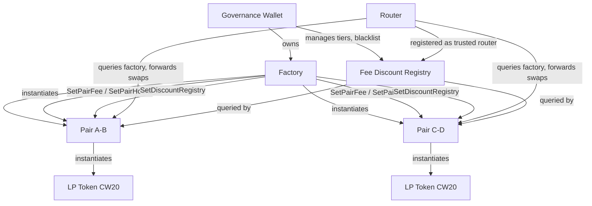
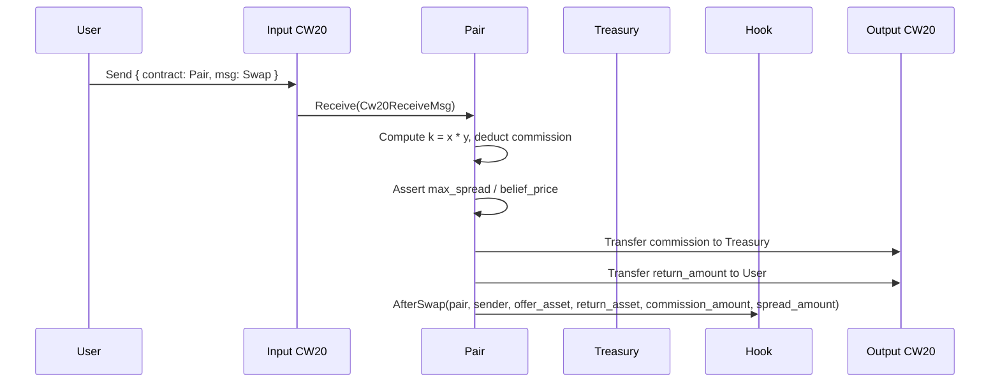
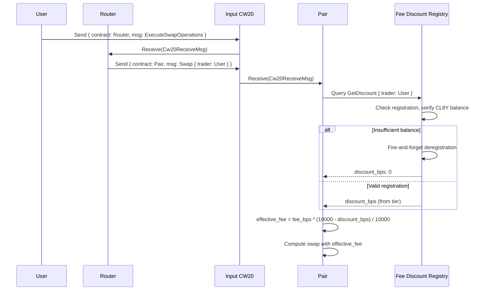
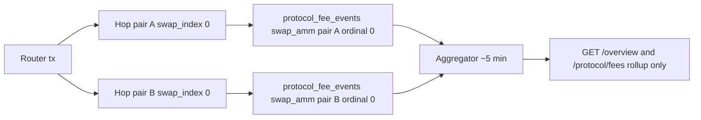

# Architecture Overview

CL8Y DEX is a constant-product AMM deployed on Terra Classic. The system comprises four core contracts — Factory, Pair, Router, and Fee Discount — plus an extensible hook interface. On-chain message and event formats are TerraSwap/Terraport-compatible for Vyntrex integration.

## Contract Relationships


```mermaid
graph TD
    GOV[Governance Wallet] -->|owns| FACTORY[Factory]
    FACTORY -->|instantiates| PAIR1[Pair A-B]
    FACTORY -->|instantiates| PAIR2[Pair C-D]
    PAIR1 -->|instantiates| LP1[LP Token CW20]
    PAIR2 -->|instantiates| LP2[LP Token CW20]
    FACTORY -->|SetPairFee / SetPairHooks| PAIR1
    FACTORY -->|SetPairFee / SetPairHooks| PAIR2
    FACTORY -->|SetDiscountRegistry| PAIR1
    FACTORY -->|SetDiscountRegistry| PAIR2
    ROUTER[Router] -->|queries factory, forwards swaps| PAIR1
    ROUTER -->|queries factory, forwards swaps| PAIR2
    DISCOUNT[Fee Discount Registry] -->|queried by| PAIR1
    DISCOUNT -->|queried by| PAIR2
    GOV -->|manages tiers, blacklist| DISCOUNT
    ROUTER -->|registered as trusted router| DISCOUNT
```

## Swap Flow


```mermaid
sequenceDiagram
    participant User
    participant CW20 as Input CW20
    participant Pair
    participant Treasury
    participant Hook
    participant OutCW20 as Output CW20

    User->>CW20: Send { contract: Pair, msg: Swap }
    CW20->>Pair: Receive(Cw20ReceiveMsg)
    Pair->>Pair: Compute k = x * y, deduct commission
    Pair->>Pair: Assert max_spread / belief_price
    Pair->>OutCW20: Transfer commission to Treasury
    Pair->>OutCW20: Transfer return_amount to User
    Pair->>Hook: AfterSwap(pair, sender, offer_asset, return_asset, commission_amount, spread_amount)
```

## Fee Discount Flow

When a pair has a discount registry configured, the swap path includes a discount lookup:


```mermaid
sequenceDiagram
    participant User
    participant Router
    participant CW20 as Input CW20
    participant Pair
    participant FeeDiscount as Fee Discount Registry

    User->>CW20: Send { contract: Router, msg: ExecuteSwapOperations }
    CW20->>Router: Receive(Cw20ReceiveMsg)
    Router->>CW20: Send { contract: Pair, msg: Swap { trader: User } }
    CW20->>Pair: Receive(Cw20ReceiveMsg)
    Pair->>FeeDiscount: Query GetDiscount { trader: User }
    FeeDiscount->>FeeDiscount: Check registration, verify CL8Y balance
    alt Insufficient balance
        FeeDiscount->>FeeDiscount: Fire-and-forget deregistration
        FeeDiscount-->>Pair: discount_bps: 0
    else Valid registration
        FeeDiscount-->>Pair: discount_bps (from tier)
    end
    Pair->>Pair: effective_fee = fee_bps * (10000 - discount_bps) / 10000
    Pair->>Pair: Compute swap with effective_fee
```

The Router passes the original trader's address through the `trader` field on `Cw20HookMsg::Swap` so the Pair can look up the correct discount. Direct swaps (without the Router) can also receive discounts — the Pair uses `info.sender` as the trader when the `trader` field is omitted.

### Discount Tiers

Governance defines tiers on the fee-discount contract (CL8Y balance thresholds and `discount_bps`). Tier **0** (100% discount) and **255** (blacklist) are governance-only; self-service tiers **1–9** use increasing CL8Y minimums. The **authoritative** ladder, `min_cl8y_balance` wire values, invariants, and example `terrad` JSON are only in **[`docs/reference/fee-discount-tiers.md`](reference/fee-discount-tiers.md)** ([GitLab #198](https://gitlab.com/PlasticDigits/cl8y-dex-terraclassic/-/issues/198)) — aligned with `smartcontracts/tests/src/tier_fixtures.rs` and verified by `make check-fee-discount-tier-docs`. Agent playbook: [`skills/AGENTS_FEE_DISCOUNT_TIERS.md`](../skills/AGENTS_FEE_DISCOUNT_TIERS.md).

CL8Y token balances are checked on every swap. If a trader's balance falls below their tier's threshold, the fee-discount contract fires a deregistration message and returns zero discount for that swap.

## TerraSwap Compatibility

Messages, queries, and events use TerraSwap field names so Vyntrex can parse our contracts without custom code:

- **AssetInfo enum:** `{ "token": { "contract_addr": "..." } }` or `{ "native_token": { "denom": "..." } }` (native rejected at runtime)
- **Swap events:** emit `offer_asset`, `ask_asset`, `offer_amount`, `return_amount`, `spread_amount`, `commission_amount`
- **Router:** uses `SwapOperation` enum with `TerraSwap` and `NativeSwap` variants (native rejected at runtime)
- **Queries:** `Config`, `Pair`, `Pairs`, `Pool`, `HybridSimulation`, `HybridReverseSimulation` (legacy `Simulation` removed — [#190](https://gitlab.com/PlasticDigits/cl8y-dex-terraclassic/-/issues/190))

Our extensions (governance, treasury, FeeConfig, code ID whitelist, post-swap hooks) are additive and don't conflict with the TerraSwap interface.

## Key Design Decisions

- **Constant product (x * y = k):** simple, battle-tested AMM invariant.
- **Fee-on-output:** fee (commission) is taken from the computed output amount, not the input.
- **belief_price / max_spread:** TerraSwap-compatible slippage protection replaces `min_output`.
- **Factory-gated governance:** only the Factory can update pair fees and hooks, keeping governance centralized at one address.
- **Code ID whitelist:** the Factory validates that both tokens in a pair were instantiated from whitelisted CW20 code IDs, preventing malicious token contracts.
- **Hook system:** post-swap hooks allow composable integrations (burn, tax, LP-burn) without modifying the core pair logic.
- **Fee discount registry:** a separate contract manages tiered fee discounts. Pairs query it during swaps, keeping discount logic decoupled from the AMM core. Balance verification on every swap ensures discounts cannot persist after tokens are moved.
- **CW20-only:** native tokens are accepted in the type system for TerraSwap wire compatibility but rejected at runtime. Future support will use CW20 wrapping.

## Limit orders (hybrid AMM + book)

FIFO limit book, Pattern C splits, and indexer route solving are documented in [limit-orders.md](./limit-orders.md). Types and caps are in `dex-common` (`HybridSwapParams`, `PlaceLimitOrder`, `CancelLimitOrder`).

## Indexer protocol fee ledger

The indexer persists treasury-bound fees in `protocol_fee_events` (census [#586](https://gitlab.com/PlasticDigits/cl8y-dex-terraclassic/-/issues/586)). Router swaps emit one wasm `action=swap` + `commission_amount` **per hop** under a single `txhash`. `parse_swaps` assigns `swap_index` **per pair** (restarts at 0 on the next pair — [#287](https://gitlab.com/PlasticDigits/cl8y-dex-terraclassic/-/issues/287)). Volume rows already use `(tx_hash, pair_id, swap_index)`. Fee uniqueness must match that shape or later hops collide.


```mermaid
flowchart LR
    TX[Router tx] --> H1[Hop pair A swap_index 0]
    TX --> H2[Hop pair B swap_index 0]
    H1 --> FE1["protocol_fee_events swap_amm pair A ordinal 0"]
    H2 --> FE2["protocol_fee_events swap_amm pair B ordinal 0"]
    FE1 --> ROLL[Aggregator ~5 min]
    FE2 --> ROLL
    ROLL --> GET["GET /overview and /protocol/fees rollup only"]
```

| Source | `pair_id` | Unique |
|--------|-----------|--------|
| `swap_amm` | factory `pairs.id` | `protocol_fee_events_pair_tx_source_ordinal_uidx` `(tx_hash, source, pair_id, ordinal)` WHERE `pair_id IS NOT NULL` |
| wrap / unwrap / ust1_* / book_take / limit_place | NULL | `protocol_fee_events_nopair_tx_source_ordinal_uidx` `(tx_hash, source, ordinal)` WHERE `pair_id IS NULL` |

Replay is `ON CONFLICT DO NOTHING` (never overwrite). Missing hops are backfilled from `swap_events.commission_amount`; GET never `SUM`s the event table. Decision, alternatives, sqlx-version leftover, rollout, and rollback: [ADR 0005](./adr/0005-protocol-fee-multihop-hops.md) ([#1269](https://git.cl8y.com/code/cl8y-dex-terraclassic/issues/1269) / [PR #1274](https://git.cl8y.com/code/cl8y-dex-terraclassic/pulls/1274)). Invariants: [`indexer-invariants.md`](./indexer-invariants.md) **Protocol fees (#586 / #1269)**. Playbook: [`AGENTS_INDEXER_PROTOCOL_FEE_HOPS.md`](../skills/AGENTS_INDEXER_PROTOCOL_FEE_HOPS.md).

## Directory Layout

```
smartcontracts/
├── contracts/
│   ├── factory/       # Pair registry, governance, code ID whitelist
│   ├── pair/          # AMM logic, LP minting/burning, fee management
│   ├── router/        # Multi-hop routing via SwapOperation
│   ├── fee-discount/  # Tiered fee discount registry for CL8Y holders
│   └── hooks/         # Post-swap hook contracts (burn, tax, lp-burn)
├── packages/
│   └── dex-common/ # Shared types (AssetInfo, Asset, PairInfo), messages, pagination
└── tests/          # Integration test harness
```
