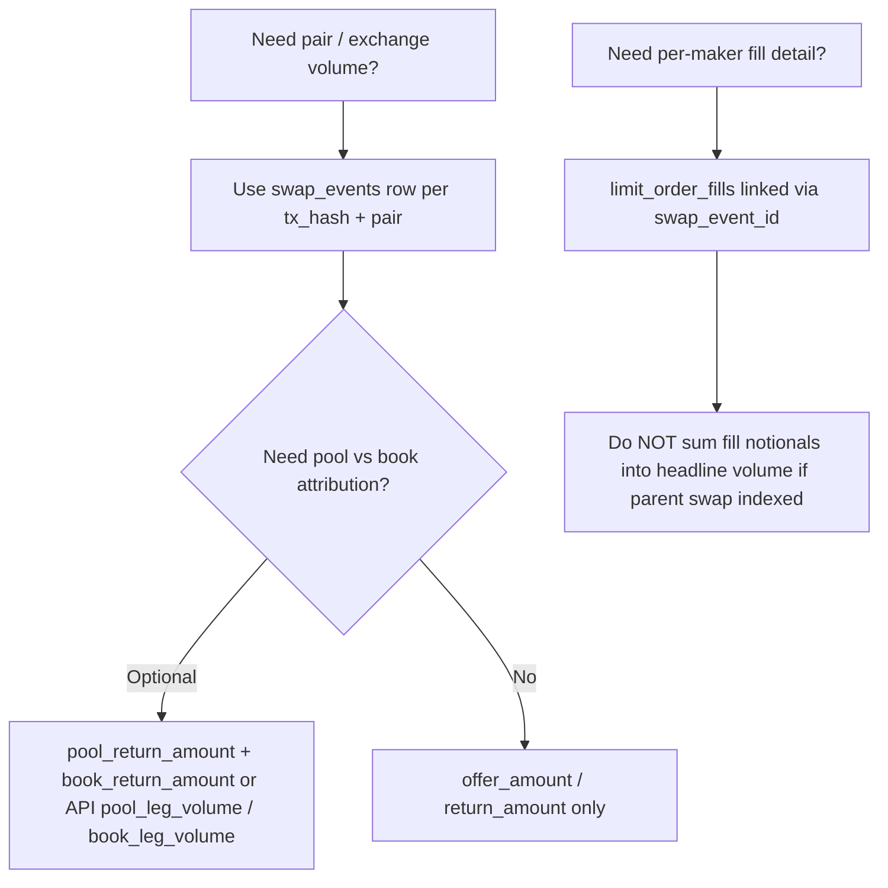

# Hybrid volume reconciliation (integrators)

**Audience:** CoinGecko, CoinMarketCap, Vyntrex, portfolio trackers, and any indexer that ingests CL8Y swap or limit-book data.

**GitLab:** [#216](https://gitlab.com/PlasticDigits/cl8y-dex-terraclassic/-/issues/216) (accuracy + docs); consolidated listing fields in [#189](https://gitlab.com/PlasticDigits/cl8y-dex-terraclassic/-/issues/189); wasm columns in [#82](https://gitlab.com/PlasticDigits/cl8y-dex-terraclassic/-/issues/82).

## One-sentence rule

**Publish 24h pair volume from `swap_events` consolidated `offer_amount` / `return_amount` once per taker swap.** Do **not** add `limit_order_fills` on top of the parent swap row.

---

## Decision tree

| Goal | Source | Safe for headline volume? |
|------|--------|---------------------------|
| 24h exchange / pair volume | `swap_events` (`offer_amount`, `return_amount`) or CG `base_volume` / `target_volume` | **Yes** |
| Pool vs book attribution (24h) | `cl8y_extensions.book_leg_volume_quote_24h`, `pool_leg_volume_quote_24h` | **No** (subset; see anti-patterns) |
| Per-trade leg split | `pool_leg_volume`, `book_leg_volume` on CG/CMC trades; same on `GET /api/v1/pairs/{addr}/trades` | **No** (explains consolidated row) |
| Maker-level fills | `GET .../limit-fills` / `limit_order_fills` table | **No** for taker volume (already in parent swap) |
| Pool-only fee metric | Swap wasm `commission_amount` | **No** (pool leg only; not volume) |
| Hook total fee | `AfterSwap.commission_amount` | **No** (fee, not volume) |

---

## Units (ask-side vs offer-side)

| Field | Side | Meaning |
|-------|------|---------|
| `offer_amount` | **Offer** (input token) | Total offer consumed (book + pool). |
| `return_amount` | **Ask** (output token) | Total ask output to receiver. |
| `pool_return_amount`, `book_return_amount` | **Ask** | Net output per leg; **`return_amount` = pool + book** (within rounding). |
| `limit_book_offer_consumed` | **Offer** | Offer matched on the book in this swap. |
| CG/CMC `pool_leg_volume`, `book_leg_volume` | **Ask** | Aliases of indexed `pool_return_amount` / `book_return_amount`. |
| `cl8y_extensions.*_leg_volume_quote_24h` | **Ask** (quote/target asset of the pair) | Sum of leg columns over 24h for **attribution**; not additive to `target_volume`. |
| `limit_order_fill` token amounts | Mixed | Per-maker economics; use for maker analytics, not taker headline volume. |

Terraport baseline attrs (`commission_amount`, `spread_amount`) are **pool-leg-only** on swap events. Book taker fees appear as `book_commission_amount` on the swap and per-fill on `limit_order_fill`. See [integrators.md § L7](./integrators.md#hybrid-swaps-and-post-swap-hooks-invariant-l7).

---

## Worked examples

### Example 1 — Pool-only swap

On-chain (no hybrid leg attrs):

- `offer_amount` = 1_000_000
- `return_amount` = 990_000
- `pool_return_amount` / `book_return_amount` = *null*

**Indexer:** one `swap_events` row; leg columns NULL.

**24h volume:** count `offer_amount` / `return_amount` once. CG `pool_only_trade_count_24h` += 1; hybrid leg extension fields may be `"0"` or omitted on the trade.

### Example 2 — Single-fill hybrid

On-chain:

- `offer_amount` = 100
- `return_amount` = 95
- `pool_return_amount` = 40
- `book_return_amount` = 55
- `limit_book_offer_consumed` = 60

Check: **40 + 55 = 95** = `return_amount`.

**24h volume:** +100 offer-side / +95 ask-side **once**. `cl8y_extensions`: `hybrid_trade_count_24h` += 1; `pool_leg_volume_quote_24h` += 40; `book_leg_volume_quote_24h` += 55 (attribution only).

### Example 3 — Multi-fill hybrid (one swap row)

One taker swap matches two makers → two `limit_order_fill` wasm events, **one** `swap_events` row with consolidated totals (e.g. `return_amount` = 95, legs 40 + 55).

**24h volume:** still **one** swap row. Use `limit_order_fills` with `swap_event_id` for maker-level detail; **do not** add fill notionals to pair volume.

---

## Null / legacy matrix

| Situation | Leg columns | Headline volume |
|-----------|-------------|-----------------|
| Pool-only v2 swap | NULL | `offer_amount` / `return_amount` |
| Hybrid swap (indexed) | Populated | Same consolidated totals |
| Pair deployed before hybrid attrs | NULL on old txs | Consolidated totals still valid |
| Stripped / partial attrs | Partial NULL | Use `return_amount`; omit leg attribution; do not invent zeros as “volume” |

Backlog: [DEX-P2-015](./reviews/20260409T030009Z/ISSUE_BACKLOG.md) — older pairs may have NULL hybrid columns on historical rows.

---

## API field mapping (one table)

| Concept | On-chain wasm | `swap_events` DB | `GET /api/v1/pairs/{addr}/trades` | CG/CMC |
|---------|---------------|------------------|-----------------------------------|--------|
| Headline offer | `offer_amount` | `offer_amount` | `offer_amount` | `base_volume` / trade `base_volume` |
| Headline ask | `return_amount` | `return_amount` | `return_amount` | `target_volume` / `quote_volume` |
| Pool leg (ask) | `pool_return_amount` | `pool_return_amount` | `pool_return_amount`, `pool_leg_volume` | `pool_leg_volume` |
| Book leg (ask) | `book_return_amount` | `book_return_amount` | `book_return_amount`, `book_leg_volume` | `book_leg_volume` |
| Book offer consumed | `limit_book_offer_consumed` | same | same | — |
| 24h hybrid count | — | aggregation | — | `cl8y_extensions.hybrid_trade_count_24h` |
| 24h leg sums (ask) | — | `get_24h_hybrid_breakdown` | — | `book_leg_volume_quote_24h`, `pool_leg_volume_quote_24h` |
| Maker fill | `limit_order_fill` | `limit_order_fills` | `GET .../limit-fills` | — |

OpenAPI: indexer Swagger UI (`/swagger-ui/`). Listing compliance: [CG_CMC_COMPLIANCE.md](./CG_CMC_COMPLIANCE.md).

---

## Anti-patterns

1. **Summing `limit_order_fills` into pair volume** when the parent `swap_events` row exists — double-counts hybrid activity.
2. **Using pool-only `commission_amount` as volume** — it is a fee field (pool leg), not traded notional.
3. **Counting limit placements, parked, or expired orders as trade volume** — only executed swaps (`action=swap`) belong in volume.
4. **Adding `book_leg_volume_quote_24h` + `pool_leg_volume_quote_24h` to `target_volume`** — extensions are an **attribution subset** of the same swaps, not extra volume.
5. **Treating NULL leg columns as zero volume** — headline volume comes from `offer_amount` / `return_amount`; legs are optional attribution.
6. **Confusing hook `commission_amount` (total fee) with swap attr `commission_amount` (pool fee only)** — see [integrators.md](./integrators.md).

---

## Downstream metrics (indexer)

These use **consolidated** `swap_events` amounts (same rule as CG/CMC):

- Pair 24h stats (`volume_quote`, `volume_base`)
- Candles (`candle_builder`)
- `token_volume_stats` / `volume_aggregator`
- Trader `total_volume` (taker swaps)

`volume_usd` is best-effort from oracle pricing on consolidated amounts; hybrid legs do not change the USD formula independently.

---

## Verification checklist

- [ ] Headline 24h volume = sum of `offer_amount` (or listing `base_volume` / `target_volume`) over `swap_events`, not fills.
- [ ] For hybrid rows with legs: `pool_return_amount + book_return_amount = return_amount`.
- [ ] CG/CMC `cl8y_extensions` present; standard volume fields unchanged.
- [ ] Internal `/api/v1/pairs/{addr}/trades` leg aliases match CG/CMC when indexed.

Tests: `indexer/tests/swap_events_hybrid_columns.rs`, `indexer/tests/api_consolidated_reporting.rs`, `indexer/tests/api_integrator_hybrid_volume.rs`.

---

## Related docs

- [integrators.md](./integrators.md) — Vyntrex / Terraport attr mapping
- [CG_CMC_COMPLIANCE.md](./CG_CMC_COMPLIANCE.md) — listing endpoints
- [indexer-invariants.md](./indexer-invariants.md) — invariant **L10** (volume reconciliation)
- [terraport.md](./terraport.md) — Terraport baseline vs CL8Y extensions
- [limit-orders.md](./limit-orders.md) — book + fills
- [skills/AGENTS_INTEGRATOR_HYBRID_VOLUME.md](../skills/AGENTS_INTEGRATOR_HYBRID_VOLUME.md) — agent playbook
