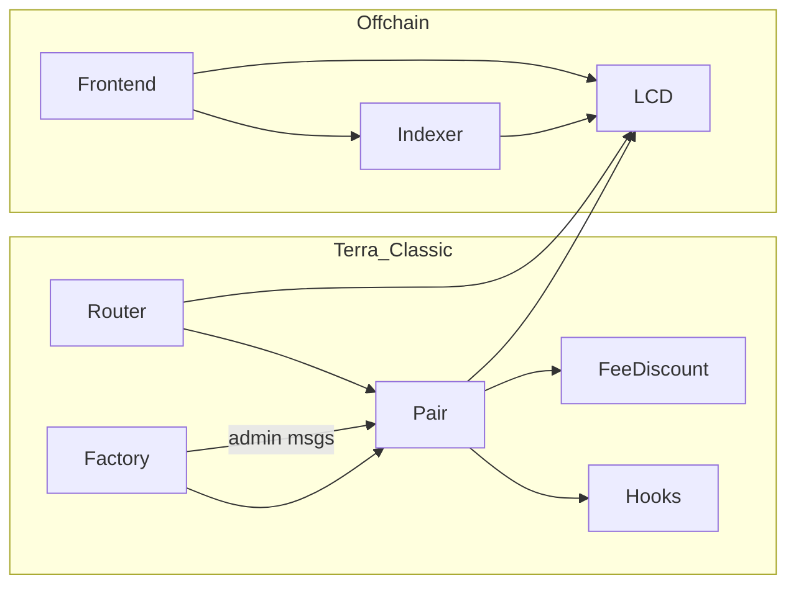

# CL8Y DEX Terra Classic — production review

**Review date (UTC):** 2026-04-09  
**Evidence baseline:** repository tree at review time; file paths relative to repo root.

---

## 1. Executive summary

This monorepo implements a **Terra Classic CosmWasm DEX**: constant-product AMM pairs, factory governance, multi-hop router, fee-discount registry, post-swap hooks, **FIFO on-chain limit orders**, and **hybrid (book + pool) swaps** on the pair contract. An **indexer** (Rust + Postgres + Axum) ingests LCD transactions and exposes read APIs including route discovery and limit-order lifecycle. A **React/Vite frontend** supports swap (including hybrid UI knobs), liquidity, tiers, charts, and a limits page.

**Program scope:** Terra Classic DEX only (contracts, indexer, frontend). **Bridge / cross-chain integration is not in scope** for this repository or this review backlog—no bridge work is tracked here.

**Production-grade gaps (highest impact):**

1. **Quote vs execution parity for hybrid and multi-hop** — Pair `Simulation` / `ReverseSimulation` and router `SimulateSwapOperations` / `ReverseSimulateSwapOperations` are **pool-only**; `hybrid` on `TerraSwap` is ignored in simulation ([`smartcontracts/contracts/router/src/contract.rs`](../../../smartcontracts/contracts/router/src/contract.rs) comments ~428–497; invariant **L8** in [`docs/contracts-security-audit.md`](../../contracts-security-audit.md)). Indexer [`route_solver.rs`](../../../indexer/src/api/route_solver.rs) returns `hybrid: null` (file header). Users and integrators can **mis-price** hybrid routes.
2. **No automated “best” hybrid split** — Book depth and pool price are not solved server-side; the dApp exposes manual pool/book split ([`frontend-dapp/src/pages/SwapPage.tsx`](../../../frontend-dapp/src/pages/SwapPage.tsx)).
3. **Indexer / API does not proxy raw on-chain limit book** — Resting orders require LCD `LimitOrder` / `OrderBookHead` queries per [`docs/limit-orders.md`](../../limit-orders.md).
4. **Post-swap hooks under-report fees on hybrid txs** — `AfterSwap.commission_amount` is pool leg only (invariant **L7**).
5. **CI builds non-optimizer wasm** for pair/factory/router — Production expects [`smartcontracts/scripts/optimize.sh`](../../../smartcontracts/scripts/optimize.sh) / `make build-optimized` ([`Makefile`](../../../Makefile) L78–87); [`.github/workflows/test.yml`](../../../.github/workflows/test.yml) uses `cargo build --target wasm32-unknown-unknown` only.

**Overall:** **v2 (pool-only) swaps** are the most complete path: contracts, router, tests, and E2E cover the happy path. **Limit orders** are implemented on-chain with strong integration tests ([`smartcontracts/tests/src/limit_order_tests.rs`](../../../smartcontracts/tests/src/limit_order_tests.rs)); frontend and indexer add partial UX/observability. **Hybrid** is implemented on-chain and in the UI but lacks honest quoting, routing, and E2E that asserts book legs.

---

## 2. Monorepo architecture inventory

### 2.1 Structure summary

| Path | Purpose | Status | Entrypoints | Config / env | Chain | v2 | Limits | Hybrid | Criticality |
|------|---------|--------|-------------|--------------|-------|----|--------|--------|-------------|
| `smartcontracts/contracts/factory/` | Pair registry, governance: fees, hooks, discount registry ref, **pause**, whitelist | **Live** | `instantiate`, `execute` | Instantiate msg | Terra Classic | ✓ | ✓ (pause blocks cancel) | ✓ (same) | **Production** |
| `smartcontracts/contracts/pair/` | AMM + limit book + hybrid `execute_swap` | **Live** | CW20 `Receive`, `ExecuteMsg` | Factory-set fee/hooks/registry | Terra Classic | ✓ | ✓ | ✓ | **Production** |
| `smartcontracts/contracts/router/` | Multi-hop `ExecuteSwapOperations`, forwards `trader`, `hybrid` per hop | **Live** | CW20 hook / native entry | Factory addr | Terra Classic | ✓ | indirect | ✓ | **Production** |
| `smartcontracts/contracts/fee-discount/` | Tiers, trusted routers, `GetDiscount` | **Live** | `execute` / `query` | CL8Y token, governance | Terra Classic | ✓ | ✓ | ✓ | **Production** |
| `smartcontracts/contracts/hooks/*` | Post-swap callbacks | **Live** | `Hook` | Allowlist | Terra Classic | ✓ | ✓ | ⚠ hybrid fee partial in payload | **Production** (optional) |
| `smartcontracts/packages/dex-common/` | Shared msgs, `HybridSwapParams`, `MAX_*_HARD_CAP` | **Live** | n/a | n/a | — | ✓ | ✓ | ✓ | **Shared lib** |
| `smartcontracts/tests/` | Integration + proptest/fuzz-style suites | **Live** | `cargo test` | cw-multi-test | Simulated | ✓ | ✓ | partial | **Dev/CI** |
| `indexer/` | Poll LCD → Postgres; Axum GET API | **Live** | `src/main.rs`, library | [`indexer/src/config.rs`](../../../indexer/src/config.rs) | Terra Classic LCD | ✓ | partial (indexed events) | partial (no hybrid in route) | **Production** (if used) |
| `frontend-dapp/` | Wallet UX | **Live** | Vite SPA | `VITE_*` ([`docs/frontend.md`](../../frontend.md)) | Terra Classic | ✓ | partial | partial | **Production** |
| `scripts/`, `docker-compose.yml`, `Makefile` | LocalTerra, deploy, QA | **Live** | shell/make | Host | Local/test | ✓ | ✓ | ✓ | **Infra** |
| `.github/workflows/test.yml` | CI | **Live** | GHA | services Postgres for indexer tests | — | ✓ | ✓ | partial | **DevOps** |

### 2.2 Component dependency map (logical)

### 2.3 Execution path maps

**Pool-only swap (v2):** User → CW20 `Send` → Pair `Receive` → [`execute_swap`](../../../smartcontracts/contracts/pair/src/contract.rs) with `hybrid` unset / zero book leg → TWAP update → constant-product math → fee to treasury → output to receiver → optional hooks.

**Router multi-hop (v2):** User → CW20 `Send` → Router → sequential submessages to pairs with `Swap` / native equivalents; `trader` forwarded for discount ([`smartcontracts/contracts/router/src/contract.rs`](../../../smartcontracts/contracts/router/src/contract.rs)).

**Limit place:** Correct CW20 → Pair `Receive` → `PlaceLimitOrder` → [`orderbook::insert_bid` / `insert_ask`](../../../smartcontracts/contracts/pair/src/orderbook.rs) + pending escrow bump.

**Limit cancel:** `ExecuteMsg::CancelLimitOrder` → owner check → unlink + refund ([`smartcontracts/contracts/pair/src/contract.rs`](../../../smartcontracts/contracts/pair/src/contract.rs)); **blocked when pair paused** (invariant **L6**, [`docs/limit-orders.md`](../../limit-orders.md)).

**Hybrid swap:** Same `execute_swap`; if `book_leg > 0`, `match_bids` or `match_asks` with `effective_fee_bps`, then `pool_input_amount` combines pool leg + book remainder per contract math ([`contract.rs`](../../../smartcontracts/contracts/pair/src/contract.rs) ~739–779).

**Quote / simulation (off-chain & queries):** Pair pool queries only; router simulation **drops** `hybrid` when querying pairs. Indexer route solve: BFS path + optional router LCD simulate — **pool-only** ops JSON.

**Failure / rollback:** CosmWasm atomic submessages; reverting hook fails whole swap ([`docs/security-model.md`](../../security-model.md)). Indexer swap insert uses `ON CONFLICT DO NOTHING` ([`docs/indexer-invariants.md`](../../indexer-invariants.md)).

---

## 3. Capability matrix

See **[ARCHITECTURE_GAP_MATRIX.md](./ARCHITECTURE_GAP_MATRIX.md)** for the full row set (exists / partial / missing / unclear / evidence / blockers / owner).

---

## 4. Gap analysis by domain (summary)

| Domain | Representative gaps | Issues |
|--------|----------------------|--------|
| Architecture | Simulation ≠ hybrid execution; dual “orderbook” concepts (CG/CMC simulated vs FIFO) | DEX-P1-003, DEX-P1-004, DEX-P2-010 |
| Contracts | Hook commission under-reports hybrid; pause freezes limit cancel (documented tradeoff) | DEX-P2-005, DEX-P3-012 |
| Backend/indexer | No REST for on-chain book head; route solver no hybrid | DEX-P1-001, DEX-P1-002 |
| Frontend | Manual hybrid split; risk users don’t understand quote mismatch | DEX-P1-005, DEX-P2-008 |
| Security | Trusted governance footguns (hooks, pause, registry) — scoped but need runbooks | DEX-P2-011, DEX-P1-006 |
| Testing | No E2E asserting hybrid book fill; no multi-hop hybrid integration test | DEX-P1-007, DEX-P1-008 |
| DevOps | CI wasm ≠ optimizer wasm; tier table drift deployment vs [`docs/architecture.md`](../../architecture.md) | DEX-P1-009, DEX-P2-013 |
| Docs/runbooks | Product-facing “what quote means” for hybrid | DEX-P2-009 |
| Observability | Indexer block time fallback uses `Utc::now()` ([`docs/indexer-invariants.md`](../../indexer-invariants.md)) | DEX-P2-014 |
| Product | Define “full hybrid”: auto-split? aggregator? | DEX-P0-EPIC |

Full detail: **[ISSUE_BACKLOG.md](./ISSUE_BACKLOG.md)**.

---

## 5. Security and testing

- **[SECURITY_REVIEW.md](./SECURITY_REVIEW.md)** — contract + indexer + frontend surfaces, governance-trusted model.
- **[TEST_GAP_MATRIX.md](./TEST_GAP_MATRIX.md)** — scenario × evidence × missing tests.

---

## 6. Operational readiness

**[RELEASE_READINESS_MATRIX.md](./RELEASE_READINESS_MATRIX.md)** — env validation, migrations, CI, monitoring, runbooks.

---

## 7. Recommended epics (decomposition order)

1. **Epic 1 — Architecture & product definition:** Define “production hybrid” (quoting, routing, UX promises). **Before** large engineering on auto-routing.
2. **Epic 2 — v2 completion:** CI optimizer parity, deployment checklist, monitoring for pool swaps.
3. **Epic 3 — Limit orders:** Indexer/LCD strategy for resting book visibility; pause/cancel communications.
4. **Epic 4 — Hybrid:** Simulation or documented off-chain estimator; optional indexer-assisted splits; hook payload extensions or docs.
5. **Epics 5–9** — Security hardening, testing, frontend safety, observability, launch docs (see backlog).

---

## 8. Issue backlog

**[ISSUE_BACKLOG.md](./ISSUE_BACKLOG.md)** — all issues with acceptance criteria and labels.

---

## 9. Fastest path to launch-safe v2 (pool-only)

1. Ship **optimizer-built wasm** in release pipeline; align CI artifact policy (**DEX-P1-009**).
2. Verify **factory + router + pair** addresses and **whitelisted code IDs** on target network ([`docs/deployment-guide.md`](../../deployment-guide.md)).
3. Ensure **treasury** and **governance** multisig operational; document **hook** policy (empty or audited hooks only) (**DEX-P1-006**).
4. Run **existing** contract + Playwright E2E (`swap.spec.ts`, `swap-tx.spec.ts`) on release candidate.
5. If using indexer: `DATABASE_URL`, migrations, `FACTORY_ADDRESS`, `CORS_ORIGINS`, optional `ROUTER_ADDRESS` per [`indexer/src/config.rs`](../../../indexer/src/config.rs).

---

## 10. What must be solved before limit orders (product launch)

On-chain limits already exist; “launch” here means **user-safe, operable limit trading**:

1. **Communicate pause behavior** — users cannot cancel while paused (**L6**); status in UI/docs (**DEX-P2-012**).
2. **Order discovery** — LCD queries or new indexer endpoints for book head / order by id (**DEX-P1-001**).
3. **Indexer accuracy** — wasm attribute variance for older pairs noted in [`docs/limit-orders.md`](../../limit-orders.md); document or backfill (**DEX-P2-015**).
4. **E2E** — `limit-orders.spec.ts` is shallow; add tx flows where feasible (**DEX-P1-010**).

---

## 11. What must be solved before hybrid (production)

1. **Honest quoting** — contract simulation extension, off-chain book walk, or explicit “quote excludes book” UX (**DEX-P1-003**, **DEX-P1-005**).
2. **Routing** — indexer or client algorithm for `pool_input` / `book_input` / `max_maker_fills` (**DEX-P1-002**, **DEX-P1-004**).
3. **Integrator docs** — hooks `commission_amount`, router simulation limits (**DEX-P2-009**).
4. **Tests** — multi-hop hybrid, gas limits, fill events (**DEX-P1-007**, **DEX-P1-008**).

---

## 12. Top 10 blocker issues to open immediately

| ID | Title |
|----|-------|
| DEX-P1-003 | Document and/or fix hybrid vs pool-only quote divergence (contracts + router + UI) |
| DEX-P1-005 | Frontend: warn when hybrid enabled that simulation/router quote may be wrong |
| DEX-P1-002 | Indexer route solver: document `hybrid: null` + optional future hybrid hints API |
| DEX-P1-009 | CI/CD: build or verify optimizer wasm for releases; document gap vs `cargo` wasm |
| DEX-P1-001 | Expose on-chain limit book via indexer or documented LCD playbook for dApp |
| DEX-P1-007 | Integration test: hybrid swap with non-empty book (contract + cw-multi-test) |
| DEX-P1-008 | Router multi-hop with `hybrid` on one hop — regression test |
| DEX-P1-006 | Launch checklist: governance, pause, hooks, treasury |
| DEX-P2-005 | Hooks: document `commission_amount` excludes book fees; optional schema bump |
| DEX-P0-EPIC | Product spec: hybrid “best execution” scope (manual vs automated) |

---

## 13. Required explicit answers

1. **What works today?** Pool swaps (direct and router), fee discounts via registry + trusted router, LP add/remove, pair creation via factory, on-chain limit place/cancel/match, hybrid execution with manual split, indexer ingestion of swaps/limit fills/placements and most read APIs, frontend swap/pool/limits/charts with wallet integration, CI for contracts/frontend/indexer/E2E.

2. **What is partial?** Hybrid quoting/routing; indexer route solve (pool-only); raw limit book HTTP API; hook accounting on hybrid; E2E depth for limits/hybrid; deployment guide tier examples vs [`docs/architecture.md`](../../architecture.md) table drift.

3. **Missing for full v2?** Release pipeline parity with optimizer wasm; operational monitoring/runbooks beyond docs; optional: wrap/native paths if “v2” is interpreted as native support (currently rejected at runtime per security model).

4. **Missing for full limit orders?** First-class book visibility in app stack; stronger cancellation/expiry UX tests; optional hint-based insert (field ignored today, [`docs/limit-orders.md`](../../limit-orders.md)).

5. **Missing for full hybrid?** Accurate quotes, automated or assisted split, multi-hop hybrid test coverage, integrator-facing contract for hook fees.

6. **Duplicated rules that can drift?** Fee tier tables (deployment guide vs architecture doc); hybrid params constructed in frontend vs router vs pair (must stay aligned with `dex-common`); indexer `effective_fee_bps` on trades vs on-chain attribute.

7. **Trust concentration?** Factory governance (fees, hooks, pause, whitelist); fee-discount governance; treasury sink; trusted routers list; hook allowlists.

8. **Governance footguns?** Reverting hook bricks swaps; pause locks limit cancels; wrong discount registry → full fee or query fallback; mis-set treasury.

9. **Bridge / cross-chain?** **Out of program scope** — not tracked in this backlog.

10. **Hidden launch blockers?** Quote misfires on hybrid; CI wasm not production-identical; indexer requires strict env (`CORS_ORIGINS`, `DATABASE_URL`); shared Postgres test flakiness if parallelism ignored ([`docs/testing.md`](../../testing.md)).

11. **Immediate issues?** See **Top 10** and **[ISSUE_BACKLOG.md](./ISSUE_BACKLOG.md)**.

12. **Epics before decomposition?** Epic 1 (product definition for hybrid) and Epic 2 (v2 release hardening) should land before large hybrid automation work.

---

*End of REVIEW.md*
