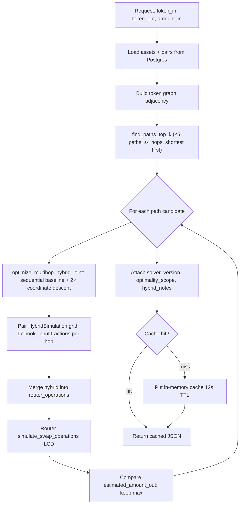

# Route solver — in-depth guide

Authoritative reference for contributors and integrators using **`GET` / `POST /api/v1/route/solve`**. The solver is **advisory**: on-chain **`max_spread`** / **`min_receive`** at execute time are authoritative. This document expands [ADR 0002](./adr/0002-global-best-execution-route-solver.md) (decision record) without changing its decisions.

**Related:** [indexer-invariants.md](./indexer-invariants.md) (HTTP matrix), [integrators.md](./integrators.md#route-discovery-and-quotes-l8), [skills/AGENTS_INDEXER_HYBRID_BEST_EXECUTION.md](../skills/AGENTS_INDEXER_HYBRID_BEST_EXECUTION.md).

---

## Glossary

| Term | Meaning | JSON / code |
|------|---------|-------------|
| **Token graph** | Undirected graph: nodes = indexed CW20 assets (`assets.contract_address`); edges = indexed pairs (`pairs`). Native-only assets without a contract address are **not** routable. | Built in `route_solver.rs` / `route_paths.rs` from Postgres |
| **Hop** | One swap leg: a pair contract, an **offer** CW20, and an **ask** CW20. | `hops[]`: `{ pair, offer_token, ask_token }` |
| **Path** | A simple (no repeated asset) sequence of hops from `token_in` to `token_out`. | `intermediate_tokens`: `[token_in, …, token_out]` |
| **Pool-only leg** | Constant-product AMM only; router op has `terra_swap.hybrid: null` (on-chain this is pool-only hybrid with `book_input = 0`). | `quote_kind`: `indexer_pool_lcd` or `indexer_route_only` |
| **Hybrid leg** | Split between pool and limit book: `pool_input + book_input = offer` for that hop. | `router_operations[].terra_swap.hybrid` |
| **`book_input` / `pool_input`** | Raw integer strings: offer amount routed to the limit book vs the AMM pool on one hop. | `HybridHopJson` in POST body / merged ops |
| **`book_start_hint`** | Optional order id to start the book walk on the **matcher side** for that hop (bid hint when offering token0, ask hint when offering token1). The global optimizer (`global_v2`) sets this to the first **live** resting order on that side when the Postgres mirror is fresh and `book_input > 0`; stale/missing mirror or pool-only hops leave it `null` ([#332](https://gitlab.com/PlasticDigits/cl8y-dex-terraclassic/-/work_items/332), [#289](https://gitlab.com/PlasticDigits/cl8y-dex-terraclassic/-/work_items/289)). Same hint is used in mirror/LCD `HybridSimulation` grid evals and in returned `router_operations`. Wrong-side hints are omitted server-side; on-chain validation (**L17**, [#272](https://gitlab.com/PlasticDigits/cl8y-dex-terraclassic/-/issues/272)) remains authoritative at execute time. | `HybridHopJson.book_start_hint` |
| **`RouteQuoteKind`** | How the quote was produced. | `quote_kind` (snake_case enum) |
| **`indexer_route_only`** | Topology only — no `estimated_amount_out` (missing `ROUTER_ADDRESS` and/or `amount_in`, or sim failed). | `RouteQuoteKind::IndexerRouteOnly` |
| **`indexer_pool_lcd`** | Pool-only router ops; LCD `simulate_swap_operations` when configured. | |
| **`indexer_hybrid_lcd`** | At least one hop has a non-zero book leg after optimization. | |
| **`indexer_hybrid_lcd_degraded`** | Hybrid grid failed on at least one hop; fell back to pool-only `HybridSimulation` (`book_input: 0`). | `OptimizationMeta.degraded` |
| **`solver_version`** | Solver generation label on global best-execution GET responses. **`global_v1`** (LCD grid) or **`global_v2`** (Postgres mirror grid when `ROUTE_SOLVER_DB_HYBRID=1`). | `best_execution::SOLVER_VERSION_LCD` / `SOLVER_VERSION_DB` |
| **`optimality_scope`** | Human-readable bound on what was searched — **not** a guarantee of global optimum over all paths or splits. | `best_execution::OPTIMALITY_SCOPE` |
| **`hybrid_notes`** | Model limits, degradation, and liability boundary for clients. | Built in `hybrid_notes_for_global` |
| **Degraded hybrid** | Per-hop: all 17 grid `HybridSimulation` candidates failed; solver uses pool-only fallback for that hop. | `quote_kind` → `indexer_hybrid_lcd_degraded` |

---

## Pipeline (global best execution)

Applies when **`GET /api/v1/route/solve`** (or **`/best`**) is called with **`amount_in`** set and **`pool_only` is not true**.



**Discovery-only GET** (no `amount_in`, or `pool_only=true`): **first** BFS shortest path only — no top-K enumeration, no hybrid optimizer. POST always uses first BFS path (max **4** hops) plus optional client `hybrid_by_hop`.

### Code map

| Stage | Module | Function / constant |
|-------|--------|-------------------|
| Graph + BFS (legacy) | `route_solver.rs` | `find_path`, `resolve_route_with_max_hops` |
| Top-K paths | `route_paths.rs` | `find_paths_top_k`, `MAX_PATH_CANDIDATES` (= 5) |
| Global winner | `best_execution.rs` | `solve_global_best_execution` |
| Per-hop / joint hybrid | `hybrid_route_opt.rs` | `optimize_multihop_hybrid_joint`, `GRID_POINTS` (= 17), `COORDINATE_PASSES` (= 2) |
| Router sim | `route_solver.rs` | `maybe_simulate` |
| Response cache | `route_solver.rs` | `ROUTE_CACHE_TTL`, `hybrid_cache_key` |

---

## API matrix: GET vs POST

| | **GET** (default) | **GET** `pool_only=true` | **GET** `/best` | **POST** |
|--|-------------------|--------------------------|-----------------|----------|
| **Hop cap** | 4 (hybrid) / 4 (discovery) | 4 | 4 | 4 |
| **Path selection** | Top-5 by hop count + max `estimated_amount_out` when `amount_in` set; else first BFS | First BFS | Same as GET + `amount_in` | First BFS only |
| **Hybrid splits** | Server `global_v1` optimizer when `amount_in` set | None (`hybrid: null`) | Server optimizer | Client `hybrid_by_hop` optional |
| **`amount_in`** | Optional (required for optimization) | Optional | **Required** | Optional |
| **`solver_version`** | Present when optimized | Absent | Present | Absent |
| **`optimality_scope`** | Present when optimized | Absent | Present | Absent |
| **Max maker fills** | Query `max_maker_fills` (default **8**) | N/A | Same | Per-hop in `hybrid_by_hop` |
| **Fee tier** | Optional `trader` / `sender` | Same | Same | Body `trader` / `sender` |

**Escape hatches**

- **`pool_only=true`** or deprecated **`hybrid_optimize=false`**: skip global solver; pool-only ops; max **4** hops.
- **`hybrid_optimize=true`** without `amount_in` → **400**.
- Zero **`amount_in`** on optimized GET → **400**.

**Example (interpretation)**

```bash
curl -sS "http://127.0.0.1:3001/api/v1/route/solve?\
token_in=terra1...&token_out=terra1...&amount_in=1000000" | jq .
```

Read the response using this doc:

- **`hops`** / **`intermediate_tokens`** — chosen path (≤ 4 hops for optimized GET).
- **`router_operations`** — submit-ready `ExecuteSwapOperations` shape; inspect `terra_swap.hybrid` per hop.
- **`estimated_amount_out`** — LCD router sim snapshot; **not** a guaranteed fill.
- **`quote_kind`** — whether hybrid legs were used or degraded.
- **`optimality_scope`** — search bounds (see below); do not market as unbounded “best price”.
- **`hybrid_notes`** — repeats liability + path/sim counts.

---

## Shipped constants (verify on solver changes)

| Constant | Value | Location |
|----------|-------|----------|
| `SOLVER_VERSION_LCD` | `global_v3` | `best_execution.rs` |
| `SOLVER_VERSION_DB` | `global_v4` | `best_execution.rs` |
| `MAX_PATH_CANDIDATES` | 5 | `best_execution.rs` |
| `SOLVE_CONCURRENCY` | 5 (bounded concurrent candidate eval; #324) | `best_execution.rs` |
| `GET_DEFAULT_MAX_HOPS` | 4 | `route_solver.rs` |
| `GET_POOL_ONLY_MAX_HOPS` | 4 | `route_solver.rs` |
| `GRID_POINTS` | 17 | `hybrid_route_opt.rs` |
| Coordinate descent passes | 2 | `hybrid_route_opt.rs` (`COORDINATE_PASSES`) |
| Default `max_maker_fills` | 8 | `route_solver.rs` |
| `ROUTE_CACHE_TTL` | 12 s | `route_solver.rs` |
| `ROUTE_CACHE_MAX_ENTRIES` | 512 | `route_solver.rs` |
| `AMOUNT_CACHE_BUCKET` | 1_000_000 (raw offer units) | `route_solver.rs` |
| `LCD_HYBRID_SIM_BUDGET` | 1700 (= 5×4×85) | `best_execution.rs` |
| `OPTIMALITY_SCOPE` | See [optimality scope](#optimality-scope-string) | `best_execution.rs` |

Cache key components: `solver_version`, `token_in`, `token_out`, **bucketed** `amount_in`, **bucketed** `max_maker_fills` (retail 1–8 → 8; see `cache_key_maker_fills`), **`discount_bps`** from resolved tier ([#283](https://gitlab.com/PlasticDigits/cl8y-dex-terraclassic/-/issues/283), [#324](https://gitlab.com/PlasticDigits/cl8y-dex-terraclassic/-/issues/324)). Trader address is **not** keyed — same-tier wallets share cache.

**Rate limits:** `route/solve` and `route/solve/best` are LCD-heavy (**10 RPS** default per IP). LCD upstream failures → **502** `Upstream LCD query failed` (sanitized).

---

## Optimality scope string

The API returns exactly (from `best_execution::OPTIMALITY_SCOPE`):

> optimal within top-5 simple paths by hop count and per-hop hybrid split grid (17 book fractions), with 2-pass coordinate refinement across hops

This means:

1. Only up to **five** simple paths are considered, preferring **fewer hops** (then lexicographic pair order).
2. On each path, each hop’s `book_input` is chosen from a **17-point** uniform grid on `[0, offer_amount]`, plus **two** full coordinate-descent passes that re-optimize each hop given the current plan.
3. The winning path is the one with highest **`estimated_amount_out`** from router `simulate_swap_operations` when `ROUTER_ADDRESS` is set (else hybrid sim totals). Ties: first path with that output wins (later equal paths do not replace).

Paths **outside** the top-5 shortest (by hop count) are never evaluated. Split points **between** grid nodes are not exhaustively searched. The solver is **not** MEV-aware and uses an **LCD snapshot** that can change before execute.

---

## Non-goals

| Not guaranteed | Why |
|----------------|-----|
| Global optimum over **all** simple paths | Only top-5 by hop count (`MAX_PATH_CANDIDATES`) |
| Optimal split between grid points | 17-point grid + 2 CD passes — not continuous convex search |
| Same quote as execute after mempool / block delay | Snapshot LCD + resting book state |
| MEV / sandwich protection | Advisory quoting only |
| POST path optimality | POST uses first BFS path; client owns `hybrid_by_hop` |
| Discovery GET without `amount_in` | Single BFS path, no comparison |

Clients **must** set on-chain **`max_spread`** / **`min_receive`** (or equivalent) at execution.

---

## Optimization theory (shipped heuristics ↔ literature)

References are **explanatory** — they do not imply the implementation is provably optimal.

### 1. Top-K simple paths by hop count

| Shipped | `route_paths::find_paths_top_k` with `MAX_PATH_CANDIDATES = 5`, iterative deepening shortest-first |
| Research | **Yen (1971)** — algorithm for K shortest simple paths; **Eppstein (1998)** — efficient K shortest paths in graphs |
| Relevance | CL8Y caps K and orders by hop count (fee/slippage priority) rather than implementing full Yen; pruning uses BFS distance-to-goal (#286) for O(V+E) soundness |

### 2. Constrained routing (hop cap, asset continuity)

| Shipped | `max_hops` = 4 (hybrid GET / pool-only / POST); simple paths only; CW20 continuity enforced per hop |
| Research | **Resource-constrained shortest path** (OR / networks); **label-setting** multicommodity routing |
| Relevance | Hop cap matches router `MAX_HOPS`; path must be simple to avoid token cycles |

### 3. Per-hop hybrid split grid

| Shipped | `optimize_one_hop`: 17 uniform `book_input` fractions; maximize pair `HybridSimulation` `return_amount` |
| Research | **Univariate grid search** / **golden-section** on unimodal functions; **coordinate descent** when multiple hops coupled |
| Relevance | Book+pool output is queried via LCD, not a closed form — grid is a practical heuristic |

### 4. Joint multihop refinement

| Shipped | `optimize_multihop_hybrid_joint`: sequential baseline, then **2** passes optimizing each hop with `propagate_offer_through_plan` |
| Research | **Block coordinate descent** (e.g. Wright 2015 survey); **alternating optimization** for coupled nonlinear objectives |
| Relevance | Hop outputs feed next hop’s offer; CD re-opens earlier hops after downstream splits change |

### 5. Pool leg simulation / liquidity-weighted routing

| Shipped | Pool leg via on-chain `HybridSimulation` / constant-product pair math inside the contract |
| Research | **Danos & Willinger (2010)** — network flow view of DeFi; **Balancer** smart-order routing / path algorithms (liquidity-weighted multihop) |
| Relevance | CL8Y does not precompute edge weights offline — each candidate path is scored by live LCD sim |

### 6. Hybrid AMM + limit book

| Shipped | Per-hop `pool_input` / `book_input` split; `max_maker_fills` caps book matches |
| Research | **Market microstructure** — price impact across lit pool vs resting liquidity; **smart order routing** splitting across venues |
| Relevance | Limit book is discrete price levels; `max_maker_fills` bounds walk depth |

### LCD query budget

Documented upper bound: `LCD_HYBRID_SIM_BUDGET = MAX_PATH_CANDIDATES × GET_DEFAULT_MAX_HOPS × (17 + 2×2×17) = **1700**` pair-level simulations per request (worst-case estimate). Post-#319 each hop is priced from the DB orderbook mirror rather than live LCD; `lcd_hybrid_queries` is an approximate running count during evaluation.

---

## Future work (not shipped)

| Upgrade | When to consider | Cost driver |
|---------|------------------|-------------|
| Increase K (`MAX_PATH_CANDIDATES`) | More pairs, frequent longer-cheaper paths | LCD calls × paths |
| Finer grid / adaptive search | Large trades where grid misses interior optimum | LCD per hop |
| Edge-weight pruning before top-K | Very dense graphs | Engineering complexity vs #286 gate |
| Yen / Eppstein full K-shortest | Need provable K-shortest without hop-first bias | CPU + LCD |
| MEV-aware routing | Not planned for advisory indexer | N/A |

Tie changes to **`LCD_HYBRID_SIM_BUDGET`**, **`RATE_LIMIT_LCD_HEAVY_RPS`**, and operator LCD capacity.

---

## Abuse / integrator pitfalls

| Vector | Mitigation |
|--------|------------|
| Treating quote as guaranteed fill | Doc + `hybrid_notes` state snapshot / advisory nature |
| Cache poisoning across tiers | Cache keys include `discount_tier` ([#283](https://gitlab.com/PlasticDigits/cl8y-dex-terraclassic/-/issues/283)) |
| Path explosion DoS | Server caps paths, hops, LCD budget; reachability gate O(V+E) ([#286](https://gitlab.com/PlasticDigits/cl8y-dex-terraclassic/-/issues/286)) |
| Micro-amount cache busting | Amount bucketing (`AMOUNT_CACHE_BUCKET`); avoid hammering unique tiny amounts |
| “Best execution” marketing | Read `optimality_scope` bounds |

---

## Frontend cross-link

The retail dApp consumes indexer routes for swap preview; sequential pair-level preflight still enforces **`max_spread`** per hop because router sim does not return per-hop spread. See [swap-max-spread-ux.md](./swap-max-spread-ux.md), [frontend.md § Swap](./frontend.md#swap-page-integration), [skills/AGENTS_FRONTEND_SWAP_ROUTE_DISPLAY.md](../skills/AGENTS_FRONTEND_SWAP_ROUTE_DISPLAY.md).

---

## Drift guard

When changing solver constants, run:

```bash
python3 scripts/check_route_solver_docs.py
```

This checks that `docs/route-solver.md` and `OPTIMALITY_SCOPE` / key constants in Rust stay aligned.
