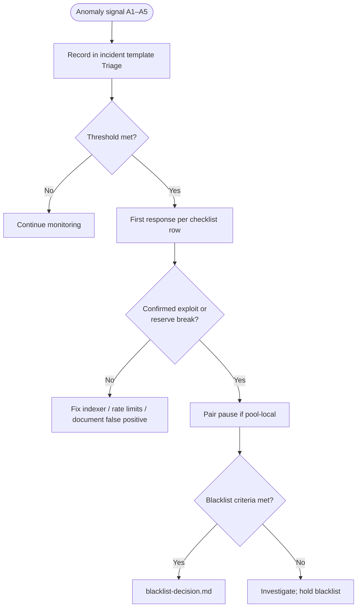

# Runbook: Proactive anomaly signals (SEC-G02)

Operator playbook for **proactive** anomaly thresholds and first-response actions during live monitoring of a **small-TVL** CL8Y DEX deployment (bootstrap band **$0–$1M** per [security-posture.md § TVL ladder](../security-posture.md#security-requirements-scale-with-tvl)). Parent remediation: GitLab [#435](https://gitlab.com/PlasticDigits/cl8y-dex-terraclassic/-/issues/435) (**SEC-G02**).

**Reactive controls** (blacklist after confirmed exploit) live in [blacklist-decision.md](./blacklist-decision.md). Use **this** runbook when dashboards, logs, or on-chain scans surface abnormal patterns **before** evidence meets blacklist criteria.

**Related:** [incident template](../templates/incident-dex-indexer.md), [emergency commands](./emergency-commands.md), [blacklist decision tree](./blacklist-decision.md), [indexer LCD security](../../skills/AGENTS_INDEXER_API_LCD_SECURITY.md), [security-posture.md](../security-posture.md).

## When to use

- On-call or operator monitoring during bootstrap / growth TVL
- Triage section of a new incident — check signals below **before** escalating to blacklist
- Post-deploy smoke when validating indexer + LCD alignment on a new network

## TVL band note

Thresholds below are tuned for **thin pools and limited operator headcount** at bootstrap TVL. Revisit thresholds when sustained protocol TVL crosses **~$5M** (growth band) — document changes on the launch tracking issue.

## Anomaly checklist

Each row is a **signal → threshold → first response**. Record the signal, measured value, UTC timestamp, and action taken in the [incident template](../templates/incident-dex-indexer.md).

| ID | Signal | Threshold (bootstrap TVL) | First response | Escalation |
|----|--------|---------------------------|----------------|------------|
| **A1** | **Single-wallet pool drain** — one address withdraws LP or swaps out more than a defined share of a pair's reserves in one session | **> 15%** of either reserve side (`reserve_0` or `reserve_1`) attributed to the same wallet within **one block** or a **10-minute** rolling window | **Pair pause** (`SetPairPaused`) on the affected pair — [emergency commands § Pair pause](./emergency-commands.md) | If drain continues via router multihop or other pairs → [blacklist decision](./blacklist-decision.md) (wallet or pair scope) |
| **A2** | **Add/remove profit loop** — repeated liquidity add then remove by one wallet suggesting sandwich or reserve manipulation | **≥ 3** full add+remove cycles on the **same pair** by the **same wallet** within **30 minutes**, with **net token profit > 0.5%** of that pair's pool TVL (USD or quote-asset equivalent) | **Investigate** — capture tx hashes, reserve deltas, and indexer route/solve quotes for the window; hold further governance action until pattern is classified | Net profit **> 2%** of pair TVL in the window, or A1 also firing → **pair pause**; confirmed exploit actor → [blacklist decision](./blacklist-decision.md) |
| **A3** | **Route slippage deviation** — off-chain quote diverges from expected execution quality relative to reserves | Indexer `slippage_percent` on `GET/POST /api/v1/route/solve` **> 30%** for a trade sized **> 1%** of the shallowest hop reserve **or** quoted `amount_out` deviates **> 5%** from on-chain `simulate_swap` / router simulation for the same path and input | **Check reserve consistency** — compare pair `pool` query (LCD) vs indexer DB reserves; reorg-halt or stale ingestion per [indexer reorg runbook](./indexer-reorg-replay-dedup.md) | Reserves inconsistent or manipulation confirmed → **pair pause**; indexer-only bug → fix ingestion, no pause |
| **A4** | **Failed tx burst** — one address generates many failing CL8Y executes (spread, min_return, hook revert, pause) | **≥ 10** failed wasm executes touching factory/router/pair contracts from the **same address** within **15 minutes** | **Rate-limit review** at indexer edge (if txs correlate with API abuse) and **wallet investigation** — sample error codes and contract targets | Confirmed exploit or abuse pattern → [blacklist decision](./blacklist-decision.md); benign bot misconfiguration → document and monitor |
| **A5** | **LCD-heavy route flood** — clients hammer LCD-backed indexer routes | **> 20%** of requests to LCD-heavy paths return **HTTP 429** over **5 minutes** **or** one client IP accounts for **> 50%** of LCD-heavy 429s in that window ([LCD-heavy list](../../skills/AGENTS_INDEXER_API_LCD_SECURITY.md#lcd-heavy-routes-stricter-governor)) | **Rate limit review** — confirm `RATE_LIMIT_LCD_HEAVY_RPS` (prod default **10**) and global `RATE_LIMIT_RPS` (prod default **60**); check for scraper or runaway frontend poll | Sustained attack or indexer overload → raise limits only after abuse source identified; edge IP block/WAF; pair pause **not** indicated unless A1–A3 also fire |

### How to measure (operator commands)

**A1 — reserve share (LCD):**

```bash
# Replace <pair>, <lcd>, <wallet>; sum swap+withdraw outputs in window via block explorer or terrad query tx
terrad query wasm contract-state smart <pair> '{"pool":{}}' --node <lcd>
# Compare wallet-attributed outflow to reserve_0 / reserve_1 for the window
```

**A2 — add/remove cycles:** indexer swap/LP tables or explorer filtered by `provide_liquidity` / `withdraw_liquidity` / `swap` for the wallet+pair; compute net profit vs pool TVL.

**A3 — slippage vs simulate:**

```bash
curl -sS "http://<indexer>/api/v1/route/solve?token_in=<addr>&token_out=<addr>&amount_in=<uamount>&pool_only=true" | jq '.slippage_percent, .amount_out'
# Compare amount_out to terrad query wasm smart simulate_swap on the quoted path
```

**A4 — failed tx volume:** filter LCD `tx_search` or explorer for `code != 0` and wasm contract addresses in the CL8Y deployment set.

**A5 — 429 rate:** indexer access logs or reverse-proxy metrics on `/api/v1/route/solve`, `limit-book`, `order-book-head`, and CG/CMC orderbook paths; count 429 vs 2xx per IP.

## Escalation map



## Cross-links

| Doc | Role |
|-----|------|
| [incident-dex-indexer.md](../templates/incident-dex-indexer.md) | Triage checklist links here |
| [blacklist-decision.md](./blacklist-decision.md) | After confirmed evidence — not on suspicion alone |
| [emergency-commands.md](./emergency-commands.md) | Copy-pastable `SetPairPaused` and blacklist txs |
| [AGENTS_INDEXER_API_LCD_SECURITY.md](../../skills/AGENTS_INDEXER_API_LCD_SECURITY.md) | LCD-heavy routes, 429 shape, rate-limit env vars |

## Verification

```bash
make check-anomaly-signals-docs
make verify-issue-435
```

Agent playbook: [`skills/AGENTS_ANOMALY_SIGNALS.md`](../../skills/AGENTS_ANOMALY_SIGNALS.md).
