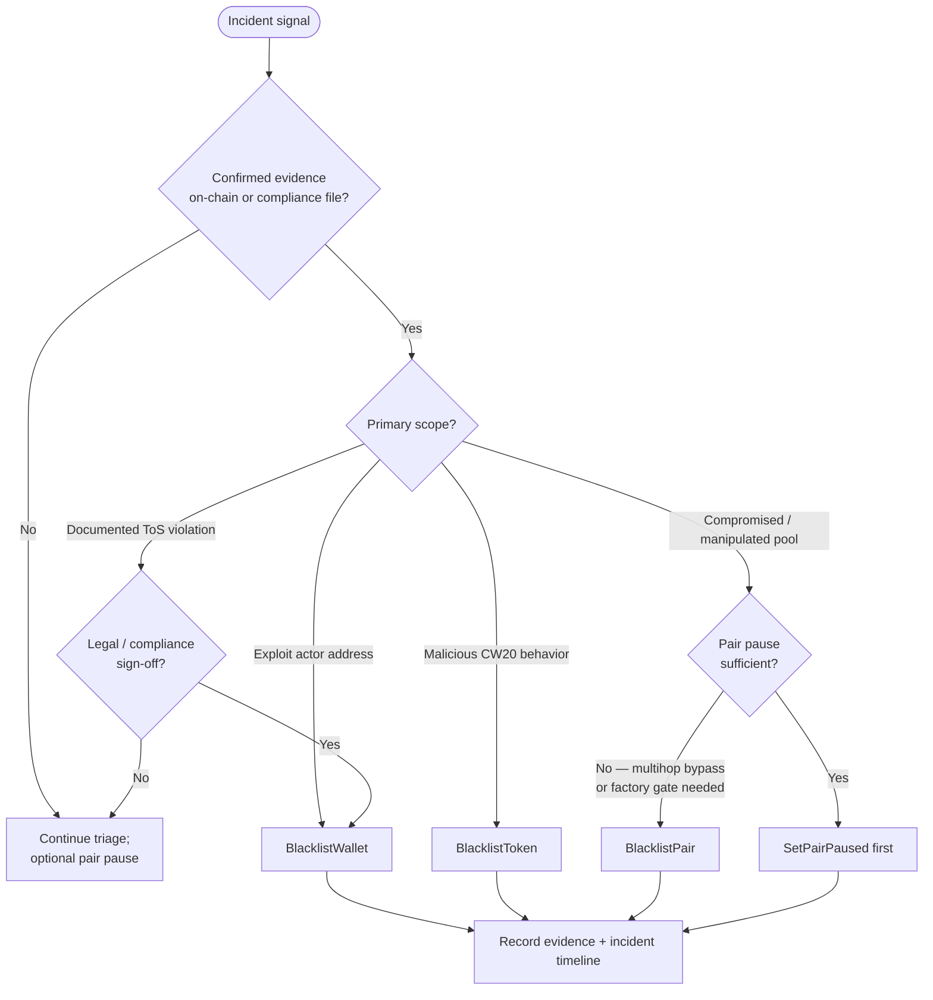

# Runbook: Trading blacklist decision tree (SEC-B12)

Operator playbook for **when** governance should apply factory trading blacklist actions during incidents, compliance escalations, and false-positive rollbacks. Parent remediation: GitLab [#400](https://gitlab.com/PlasticDigits/cl8y-dex-terraclassic/-/issues/400) (**SEC-B12**).

**Related:** [ADR 0003](../adr/0003-governance-trading-blacklist.md), [security-model.md § Trading blacklist](../security-model.md#trading-blacklist-compliance--incident-response), [user-incident-faq.md](../user-incident-faq.md) (trader/LP impact — link, do not duplicate), [incident template](../templates/incident-dex-indexer.md), [anomaly signals runbook](./anomaly-signals.md) (proactive thresholds before blacklist — SEC-G02, [#435](https://gitlab.com/PlasticDigits/cl8y-dex-terraclassic/-/issues/435)), [launch-checklist.md](./launch-checklist.md).

## Policy summary

| Dimension | Factory message | Blocks |
|-----------|-----------------|--------|
| Wallet | `BlacklistWallet` | All protocol paths for that address (swaps, LP, limits, router multihop) |
| Token | `BlacklistToken` | Any trade touching the CW20 on any pair |
| Pair | `BlacklistPair` | All user actions on that pair contract |

**Not the same as Tier 255:** fee-discount tier 255 only removes discounts; trading continues. Use factory blacklist when trading must halt ([security-model.md](../security-model.md)).

**Prefer narrower controls when sufficient:** pair **pause** (`SetPairPaused`) stops trading on one pool without factory registry changes. Escalate to blacklist when scope or bypass risk requires factory-level gating.

## Decision tree

Use this during incident **Mitigation** after triage confirms abnormal on-chain or compliance signals. For **proactive** monitoring thresholds (pool drain %, slippage deviation, failed-tx burst, etc.) before evidence is confirmed, start from [anomaly-signals.md](./anomaly-signals.md). Do **not** blacklist on suspicion alone.



### Severity → action hints

Map incident severity (from [incident template](../templates/incident-dex-indexer.md)) to **first** blacklist step. Pair pause remains valid for pool-local incidents at any severity.

| Severity | Typical action |
|----------|----------------|
| **S1** — active exploit / ongoing loss | Immediate blacklist matching scope (wallet, token, or pair) after minimum evidence capture below |
| **S2** — confirmed compromise, contained | Blacklist or pair pause per scope; prefer narrowest control that stops loss |
| **S3** — degraded / suspected | Investigate; **no blacklist** until confirmation criteria met |
| **S4** — cosmetic / informational | **No blacklist**; monitor and document |

## Classification criteria

### Wallet blacklist (`BlacklistWallet`)

Apply when **all** of the following are true:

1. **Confirmed exploit actor** — on-chain evidence shows the address **participated in** theft, drain, or protocol abuse (not address clustering or heuristics alone). Preserve:
   - Transaction hashes and block heights
   - Affected pair/token/router addresses
   - Estimated value at risk or realized loss
2. **Scope is the actor** — blocking the wallet stops further abuse; token- or pair-wide block is unnecessary.
3. **Governance approval** — multisig/DAO executes per [launch-checklist.md](./launch-checklist.md); incident commander records approver and UTC timestamp in the incident tracker.

**Terms-of-service violations:** blacklisting may also apply when **legal or compliance review** confirms repeated or egregious ToS violations **and** a case file exists (abuse reports, confirmed Sybil/market-manipulation pattern tied to the address, court order, or internal compliance escalation). ToS-only cases still require documented sign-off — **not** single-operator discretion.

**Do not apply when:**

- Evidence is circumstantial (shared funding source, timing correlation only).
- Issue is a **malicious token** or **broken pool** — use token or pair blacklist / pause instead.
- Fee-discount removal is enough — use Tier 255, not factory blacklist.

### Token blacklist (`BlacklistToken`)

Apply when **all** of the following are true:

1. **Malicious CW20 behavior verified by contract inspection** — not ticker confusion or unverified rumor. Examples:
   - Fee-on-transfer or balance-skimming after whitelist approval
   - Hidden mint, blacklist, or transfer hook that steals from swappers/LPs
   - Reentrancy or balance manipulation against pair accounting
2. **Token exposure is multi-pair** — pausing one pool does not contain risk.
3. **Evidence preserved** — code ID, contract address, inspection notes (wasm hash or tagged release diff), sample failing txs.

**Do not apply when:**

- Token is benign but **one pool** is misconfigured — use pair pause or pair blacklist.
- Token is not yet whitelisted — use whitelist denial instead of blacklist.

### Pair blacklist (`BlacklistPair`)

Apply when **all** of the following are true:

1. **Compromised pool** — confirmed accounting error, reserve invariant break, or **active manipulation targeting that pair** (not generic market volatility).
2. **On-chain verification** — reserve reads, swap traces, or limit-book state inconsistent with expected pair behavior; sample txs attached to incident record.
3. **Pause insufficient** — attackers bypass via router multihop, or factory-level gate is required to block all pair execute paths during investigation.

**Do not apply when:**

- Factory-wide or token-wide issue — use wallet or token blacklist.
- Temporary RPC/indexer staleness — fix off-chain ingestion first ([indexer reorg runbook](./indexer-reorg-replay-dedup.md)).

## Evidence before action

Before any governance `Blacklist*` tx, the incident record must include:

| Field | Required |
|-------|----------|
| Scope (wallet / token / pair) and target address(es) | Yes |
| Evidence summary + links (tx hashes, blocks, analysis) | Yes |
| Severity (S1–S4) and incident commander | Yes |
| Alternatives considered (pause, Tier 255, hook-only block) | Yes |
| Approver(s) for governance execution | Yes |

## False-positive rollback (`Unblacklist*`)

If a blacklist was applied in error, **do not** submit `UnblacklistWallet`, `UnblacklistToken`, or `UnblacklistPair` until the rollback checklist is complete.

### Rollback checklist (mandatory)

1. **Preserve original evidence** — copy into the incident record (immutable section or attached export): original tx hashes, analysis, approver names, blacklist governance tx hash, UTC timestamps. Do **not** delete prior notes when reversing.
2. **Document reversal reason** — false positive, mistaken identity, remediated contract upgrade, or compliance case closure.
3. **Confirm no funds at risk** — re-query on-chain state (reserves, escrow, attacker still active). If reversal re-exposes loss, stop and escalate to S1 review.
4. **Log in incident timeline** — entry with reversal approver, checklist completion UTC, and planned `Unblacklist*` tx.
5. **Execute governance `Unblacklist*`** — record resulting tx hash in the timeline.
6. **Communications** — if users saw blocked CTAs, note public/internal comms in the incident template **Communications** section.
7. **Post-incident** — if criteria misfired, open a docs follow-up to tighten this runbook.

User-facing impact after rollback: [user-incident-faq.md](../user-incident-faq.md).

## Execution reference

Governance-only factory messages ([ADR 0003](../adr/0003-governance-trading-blacklist.md)):

```bash
# Wallet
terrad tx wasm execute <factory> '{"blacklist_wallet":{"address":"<terra1...>"}}' ...

# Token
terrad tx wasm execute <factory> '{"blacklist_token":{"token":"<terra1...>"}}' ...

# Pair
terrad tx wasm execute <factory> '{"blacklist_pair":{"pair":"<terra1...>"}}' ...

# Rollback (after checklist above)
terrad tx wasm execute <factory> '{"unblacklist_wallet":{"address":"<terra1...>"}}' ...
```

**Preflight:** factory `BlacklistCheck { wallet, tokens, pair, pairs }` or indexer `GET /api/v1/compliance/blacklist-check`.

## Verification

```bash
make check-blacklist-decision-docs
make verify-issue-400
```

Agent playbook: [`skills/AGENTS_BLACKLIST_DECISION.md`](../../skills/AGENTS_BLACKLIST_DECISION.md).
