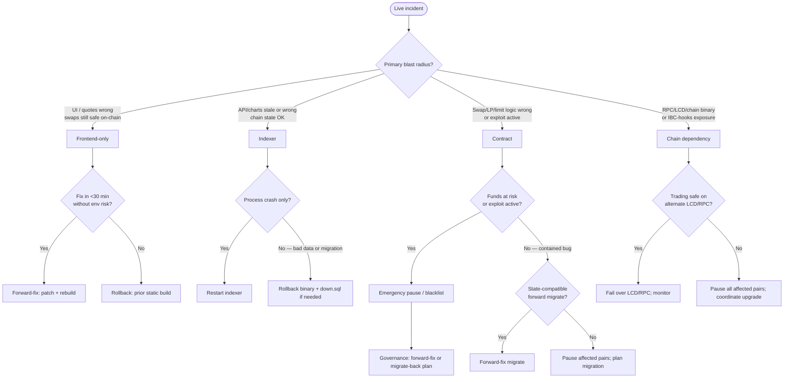

# Runbook: Rollback and forward-fix decision tree (SEC-H09)

Operator playbook for **when** to rollback vs hotfix forward during live incidents across the four deployment surfaces: **frontend**, **indexer**, **CosmWasm contracts**, and **chain dependencies**. Parent remediation: GitLab [#445](https://gitlab.com/PlasticDigits/cl8y-dex-terraclassic/-/issues/445) (**SEC-H09**).

**Related:** [launch-checklist.md § Rollback / incident](./launch-checklist.md#rollback--incident), [wasm admin migration](./wasm-admin-migration.md), [emergency commands](./emergency-commands.md) (on-chain pause/blacklist), [blacklist decision](./blacklist-decision.md) (exploit/compliance — distinct from deploy rollback), [indexer reorg / replay](./indexer-reorg-replay-dedup.md), [incident template](../templates/incident-dex-indexer.md), [user incident FAQ](../user-incident-faq.md). Agent playbook: [`skills/AGENTS_ROLLBACK_DECISION.md`](../../skills/AGENTS_ROLLBACK_DECISION.md).

## Policy summary

| Surface | Typical symptom | First control | Rollback available? |
|---------|-----------------|---------------|---------------------|
| **Frontend** | Broken UI, wrong `VITE_*` addresses, CSP/connect-src failure | Hotfix build or redeploy prior static artifact | Yes — prior `dist/` or Render deploy rollback |
| **Indexer** | Crash loop, wrong API data, failed migration | Restart process; rollback binary + optional `down.sql` | Partial — schema rollback only when paired `.down.sql` exists |
| **Contract** | Logic bug post-migrate | Emergency **pause** / blacklist; forward-fix **migrate** | Partial — migrate to prior `code_id` only if still on chain and state compatible |
| **Chain dependency** | Chain upgrade incompatibility, IBC-hooks patch, LCD/RPC outage | Pause pairs; switch LCD provider; wait for validator upgrade | No on-chain rollback — coordinate with network |

**On-chain user txs during a bad window cannot be rolled back.** Rollback paths restore **operator-controlled** surfaces (static site, indexer mirror, contract code pointer). Record all steps in the [incident timeline](../templates/incident-dex-indexer.md#incident-timeline).

## Top-level decision tree

Classify the incident **before** choosing a path. Many incidents combine surfaces (e.g. contract bug + stale indexer); treat **on-chain risk first**, then off-chain mirrors.



---

## 1. Frontend-only incident

### Symptoms / triggers

- Broken production build (blank page, JS error, failed asset load).
- Wrong inlined contract addresses (`VITE_FACTORY_ADDRESS`, `VITE_ROUTER_ADDRESS`, pair env vars).
- Mixed-content or CSP `connect-src` blocks indexer/LCD (swaps fail in browser only; chain txs from CLI still work).
- WalletConnect / Keplr connect failures caused by frontend config (not chain halt).

### Decision criteria

| Choose | When |
|--------|------|
| **Forward-fix (hotfix)** | Root cause is a **small, verified** config or code fix; you can ship a new static build in minutes; **no** wrong-address risk remains in the prior artifact; on-chain trading is safe. |
| **Rollback (revert artifact)** | Bad build is live; fix is uncertain or needs review; wrong `VITE_*` addresses were inlined; or hotfix pipeline is slower than restoring the last known-good deploy. |
| **Pause on-chain (escalate)** | Frontend bug **misroutes** swaps to attacker-controlled contracts or indexer URL — treat as **contract/security** incident; pause affected pairs per [emergency commands](./emergency-commands.md) while rolling back frontend. |

### Rollback path (commands)

Production static hosting (Render example — adapt to your CDN):

```bash
# 1. Identify last known-good git tag or deploy ID from launch tracking issue / deploy trace
git fetch --tags
export GOOD_SHA="<prior-release-sha>"

# 2. Rebuild from that commit with production env (never reuse a dev .env.local)
git checkout "$GOOD_SHA"
cd frontend-dapp
# Load production VITE_* from your secret store — not from repo
npm ci && NODE_OPTIONS=--max-old-space-size=4096 npm run build

# 3. Publish dist/ (Render: trigger manual deploy from GOOD_SHA branch or upload artifact)
# Render dashboard: Service → Deploys → Rollback to previous deploy (if available)

# 4. Invalidate CDN cache if fronted by Cloudflare/etc.
```

**Local verification before promote:**

```bash
make lint-frontend
make test-frontend
# Optional smoke against staging indexer:
VITE_INDEXER_URL=https://<staging-indexer> npm run build
```

### Limitations

- Static rollback does **not** undo user transactions broadcast during the bad window.
- `VITE_*` are **baked in at build time** — rolling back without matching env reproduces the old bug if env was the root cause; verify env file against [deploy trace](../templates/deploy-trace.md).
- Browser cache may serve stale `index.html` — HTML is `Cache-Control: no-cache, must-revalidate` ([`docker/frontend/nginx.conf`](../../docker/frontend/nginx.conf)). If a CDN ignores that, purge `/` and `/index.html` (not hashed JS). Long-lived tabs after a Coolify roll recover via one-shot document reload ([GitLab **#706**](https://gitlab.com/PlasticDigits/cl8y-dex-terraclassic/-/issues/706), [`AGENTS_FRONTEND_LAZY_CHUNK_LOAD.md`](../../skills/AGENTS_FRONTEND_LAZY_CHUNK_LOAD.md)); a 404 of a **new** hash must not be cached as `immutable`.

### Recovery verification

- [ ] `/protocol` shows expected factory/router addresses ([security model § Off-chain trust](../security-model.md#off-chain-trust-boundaries-frontend)).
- [ ] Swap page loads quotes from indexer (`VITE_INDEXER_URL` HTTPS, no mixed content).
- [ ] Route row visible at confirmation ([`AGENTS_FRONTEND_SWAP_ROUTE_DISPLAY.md`](../../skills/AGENTS_FRONTEND_SWAP_ROUTE_DISPLAY.md)).
- [ ] Record deploy SHA + UTC in [incident timeline](../templates/incident-dex-indexer.md#incident-timeline).

---

## 2. Indexer incident

### Symptoms / triggers

- Process exit / OOM / panic loop.
- API returns stale or incorrect data (charts, routes, pair list) while LCD shows correct on-chain state.
- Failed `sqlx migrate` on startup after a release.
- Reorg halt (`INDEXER_REORG_HALT`) — see [indexer reorg runbook](./indexer-reorg-replay-dedup.md) (may be chain + indexer combined).

### Decision criteria

| Choose | When |
|--------|------|
| **Restart only** | Crash from transient LCD 429, OOM, or host reboot; **no** schema change in the failing release; data spot-checks match LCD. |
| **Forward-fix** | Bug is in indexer logic but schema is compatible; patch release ready; safe to redeploy binary and catch up from `last_indexed_height`. |
| **Rollback binary** | New release introduced bad parsing, wrong migrations, or data corruption; prior release binary is known-good. |
| **Rollback schema (`down.sql`)** | A migration in the bad release must be reversed **and** a paired `.down.sql` exists under [`indexer/migrations/revert/`](../../indexer/migrations/revert/) ([docs/testing.md § Manual rollback SQL](../testing.md#frontend-integration-tests-charts--indexer)). |

### Rollback path (commands)

```bash
# 1. Stop indexer (systemd, k8s, or tmux)
# systemctl stop cl8y-indexer

# 2. Note current migration version
source indexer/.env
psql "$DATABASE_URL" -X -c "SELECT version FROM _sqlx_migrations ORDER BY version DESC LIMIT 5;"

# 3. If the bad release ran a new migration, apply manual down.sql ONLY when documented
# Example (adjust filename to the migration being reverted):
psql "$DATABASE_URL" -X -v ON_ERROR_STOP=1 \
  -f indexer/migrations/revert/20260509160000_limit_order_placement_lifecycle.down.sql

# 4. Deploy prior release binary
export PATH="/usr/local/cargo/bin:$PATH"
git checkout "<prior-release-sha>"
cd indexer && cargo build --release
# Install binary to service path, e.g. cp target/release/cl8y-indexer /usr/local/bin/

# 5. Restart and watch logs
cd indexer && cargo run --release
# Or: systemctl start cl8y-indexer
```

**Reorg-specific recovery** (not a version rollback — cursor reset):

```bash
./scripts/indexer-reorg-recover.sh --height <FORK_HEIGHT> --cleanup-derived --apply
```

See [indexer reorg runbook § Shallow reorg recovery](./indexer-reorg-replay-dedup.md#shallow-reorg-recovery-1–few-blocks).

### Limitations

- Most migrations have **no** automatic down path — rolling back binary without `down.sql` leaves schema ahead of code (startup may fail).
- Derived tables (swaps, charts) may need rebuild from chain replay after a bad ingest window.
- `down.sql` may **drop data** — take a Postgres snapshot before applying.
- Indexer rollback does **not** fix on-chain state; pair pause may still be required if users acted on bad off-chain quotes.

### Recovery verification

```bash
curl -sS "${INDEXER_URL:-http://127.0.0.1:3001}/health" | jq .
curl -sS "${INDEXER_URL}/api/v1/pairs?limit=3" | jq '.items[0].pair_address'
# Compare reserves to LCD for a sample pair:
terrad query wasm contract-state smart "<pair_addr>" '{"pool":{}}' --node "$LCD_URL" | jq '.data'
```

- [ ] `/health` returns OK; block lag acceptable vs chain head.
- [ ] Spot-check pair reserves and recent swaps against LCD.
- [ ] No `INDEXER_REORG_HALT` in logs after recovery.
- [ ] Record binary SHA, migration actions, and UTC in incident timeline.

---

## 3. Contract incident

### Symptoms / triggers

- Logic bug discovered **after** wasm migrate (incorrect fees, broken limits, hook dispatch).
- Exploit or abnormal drain on a pair (may also need [blacklist decision](./blacklist-decision.md)).
- Migration left contract in inconsistent state (failed mid-governance).

### Decision criteria

| Choose | When |
|--------|------|
| **Emergency pause** | Active loss, exploit in progress, or unknown scope — [pause pair](./emergency-commands.md#1-pause-a-pair) or blacklist per [blacklist decision](./blacklist-decision.md). |
| **Forward-fix migrate** | Bug is fixable in new wasm; `Migrate` preserves state; governance can execute quickly; **no** irreversible state corruption. |
| **Migrate back to prior `code_id`** | Prior wasm is still **stored on chain**; migration path is reversible; post-migrate state is compatible with old code (verify in `cw-multi-test` / staging). |
| **Pause-and-wait** | Fix requires audit or multisig delay; funds are contained by pause; communicate per [incident comms](../templates/incident-dex-indexer.md#appendix-communications-templates-sec-g05). |

### Rollback path (commands)

**Pause first when in doubt:**

```bash
# See emergency-commands.md — export FACTORY_ADDR, PAIR_ADDR, GOVERNANCE_KEY, etc.
terrad tx wasm execute "$FACTORY_ADDR" "$(jq -nc \
  --arg pair "$PAIR_ADDR" \
  '{set_pair_paused:{pair:$pair,paused:true}}')" \
  --from "$GOVERNANCE_KEY" --chain-id "$CHAIN_ID" --node "$NODE" \
  --gas auto --gas-adjustment 1.4 --fees 500000uluna -y
```

**Forward-fix migrate** (preferred when state-compatible):

```bash
# Store optimized wasm (workspace-optimizer only — see wasm-admin-migration.md)
terrad tx wasm store artifacts/cl8y_dex_pair.wasm \
  --from <wallet> --gas auto --gas-adjustment 1.4 \
  --fees 500000uluna --chain-id <chain-id> --node <rpc-url>

terrad tx wasm migrate <pair_addr> <new_code_id> '{}' \
  --from <admin> --gas auto --gas-adjustment 1.4 \
  --fees 500000uluna --chain-id <chain-id> --node <rpc-url>
```

**Migrate back** to prior `code_id` (only when limitations below are satisfied):

```bash
# Prior code_id must still exist on chain:
terrad query wasm list-code --node <lcd> | jq '.code_infos[] | select(.code_id=="<prior_code_id>")'

terrad tx wasm migrate <pair_addr> <prior_code_id> '{}' \
  --from <admin> --gas auto --gas-adjustment 1.4 \
  --fees 500000uluna --chain-id <chain-id> --node <rpc-url>
```

Full checklist: [wasm admin migration](./wasm-admin-migration.md). Regression: `make test-contracts` / `migration_tests`.

### Limitations

- **CosmWasm cannot delete** uploaded code; old `code_id` remains only if still on chain and admin retained.
- **Admin key loss** or admin transfer without backup blocks migrate-back.
- State written by a **new** migration may be **incompatible** with older wasm — migrate-back can brick the contract; prefer pause + forward-fix after staging proof.
- Factory/router/pair upgrades are **governance-gated** — rollback is not a single-button k8s deploy.
- User funds in limit-order escrow and LP positions remain on-chain during pause — rollback does not automatically return them.

### Recovery verification

```bash
terrad query wasm contract-state smart "$PAIR_ADDR" '{"is_paused":{}}' --node "$LCD" | jq '.data'
terrad query wasm contract <pair_addr> --node <lcd> | jq '.contract_info.code_id'
make test-contracts   # or staging smoke against migrated addr
```

- [ ] Paused pairs unpause only after [unpause prerequisite checklist](./emergency-commands.md#2-unpause-a-pair) (SEC-G07).
- [ ] Post-migrate queries match expected state (pool, fees, hooks).
- [ ] Update [deploy trace](../templates/deploy-trace.md) with new `code_id` and git SHA.
- [ ] Record governance tx hashes in incident timeline.

---

## 4. Chain dependency incident

### Symptoms / triggers

- Terra Classic **chain upgrade** breaks LCD/RPC queries or wasm execution semantics.
- **IBC-hooks** or SDK patch required on the network ([SEC-D02](../security-model.md#ibc-hooks-chain-dependency-sec-d02), [#407](https://gitlab.com/PlasticDigits/cl8y-dex-terraclassic/-/issues/407)).
- Primary **LCD/RPC provider** outage or rate-limit storm (indexer and frontend degraded).
- Validator halt or consensus failure (all txs fail).

### Decision criteria

| Choose | When |
|--------|------|
| **Fail over LCD/RPC** | Alternate healthy endpoints exist; contracts unchanged; trading is safe once clients reconnect. |
| **Wait for chain upgrade** | Validators scheduled a patch; no protocol workaround; **pause** if trading on vulnerable chain build is unsafe. |
| **Pause all affected pairs** | IBC-hooks or SDK bug exposes bridged assets used in pools; cannot mitigate off-chain; until network patch is live. |
| **Update indexer `LCD_URLS` + frontend `VITE_TERRA_*`** | Provider-specific outage; chain consensus healthy on another endpoint. |

### Coordination path

1. **Monitor** validator / Terra Classic community channels for upgrade height and binary version.
2. **Record** chain version on launch issue — re-run [launch-checklist Phase 0 IBC-hooks gate](./launch-checklist.md#phase-0--preconditions):

   ```bash
   terrad version --long --node <lcd>
   make verify-no-ibc-hooks-in-contracts
   make verify-issue-407
   ```

3. **Pause** high-TVL pairs first — [quick pool triage](./emergency-commands.md#quick-pool-triage-sec-g03).
4. **Coordinate** with other operators if shared infrastructure (public RPC) is attacked — switch to dedicated nodes.
5. **Communicate** user impact via [incident comms templates](../templates/incident-dex-indexer.md#appendix-communications-templates-sec-g05).

### Rollback path (commands)

There is **no operator rollback of chain state**. Mitigations are **failover** and **trading halt**:

```bash
# Fail over indexer LCD (indexer/.env or host env)
export LCD_URLS="https://<backup-lcd-1>,https://<backup-lcd-2>"
# Restart indexer after env change

# Fail over frontend build-time endpoints (requires rebuild + redeploy)
# VITE_TERRA_LCD_URL / VITE_TERRA_RPC_URL in production secret store

# Trading halt — pause top pools (repeat per pair or use governance playbook)
terrad tx wasm execute "$FACTORY_ADDR" "$(jq -nc \
  --arg pair "$PAIR_ADDR" \
  '{set_pair_paused:{pair:$pair,paused:true}}')" \
  --from "$GOVERNANCE_KEY" --chain-id "$CHAIN_ID" --node "$NODE" \
  --gas auto --gas-adjustment 1.4 --fees 500000uluna -y
```

### Limitations

- Chain upgrades are **validator-driven** — DEX operators cannot revert a passed governance proposal.
- Pausing pairs does **not** protect funds already bridged via a vulnerable IBC-hooks path on **other** protocols.
- LCD failover may serve **lagging** or **forked** nodes — verify block height and hash against a second source before unpause.

### Recovery verification

- [ ] `terrad status --node <rpc>` shows syncing `false` and advancing height.
- [ ] `make verify-no-ibc-hooks-in-contracts` still passes for app wasm posture.
- [ ] Indexer `last_indexed_height` within acceptable lag of chain head.
- [ ] Frontend and indexer use healthy LCD/RPC; sample swap simulation succeeds.
- [ ] Unpause only per [SEC-G07](./emergency-commands.md#2-unpause-a-pair) checklist after chain patch confirmed.

---

## Doc invariant (SEC-H09)

```bash
make check-rollback-decision-docs
make verify-issue-445
```
