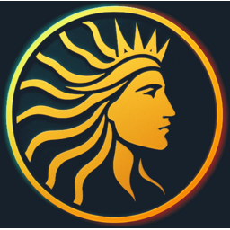
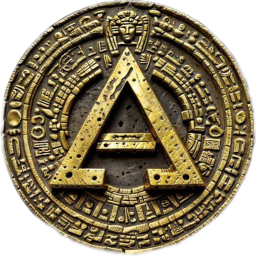

# CL8Y DEX Token List

Community-maintained token list for the CL8Y DEX on Terra Classic.

**Raw token list URL:**
```
https://gitlab.com/PlasticDigits/cl8y-dex-terraclassic/-/raw/main/tokenlist/tokenlist.json
```

## Adding a New Token

To list your token on CL8Y DEX, submit a merge request with the following:

### 1. Add your token image

- Place a **256 x 256 px PNG** in `tokenlist/images/`
- Filename must match your token symbol in uppercase: `SYMBOL.png`
- Use a transparent background where possible
- Keep file size under 100 KB (use [TinyPNG](https://tinypng.com/) or similar)

### 2. Add your token entry

Add an object to the `tokens` array in `tokenlist/tokenlist.json`:

**Native token:**

```json
{
  "symbol": "LUNC",
  "name": "Terra Luna Classic",
  "denom": "uluna",
  "type": "native",
  "decimals": 6,
  "logoURI": "https://gitlab.com/PlasticDigits/cl8y-dex-terraclassic/-/raw/main/tokenlist/images/LUNC.png"
}
```

**CW20 token:**

```json
{
  "symbol": "MYTOKEN",
  "name": "My Token",
  "address": "terra1...",
  "type": "cw20",
  "decimals": 6,
  "logoURI": "https://gitlab.com/PlasticDigits/cl8y-dex-terraclassic/-/raw/main/tokenlist/images/MYTOKEN.png",
  "website": "https://mytoken.com"
}
```

### Field reference

| Field | Required | Description |
|-------|----------|-------------|
| `symbol` | Yes | Ticker symbol (e.g. `LUNC`) |
| `name` | Yes | Full token name |
| `type` | Yes | `native` or `cw20` |
| `denom` | Native only | On-chain denomination (e.g. `uluna`, `uusd`) |
| `address` | CW20 only | Contract address on Terra Classic |
| `decimals` | Yes | Token decimal places (usually `6`) |
| `logoURI` | Yes | GitLab raw URL to the image in `tokenlist/images/` |
| `website` | No | Project website |

### 3. Submit your merge request

1. Fork this repository
2. Create a branch: `add-token/SYMBOL`
3. Add your image and JSON entry as described above
4. Open a merge request with:
   - Token name and symbol
   - Contract address (for CW20 tokens)
   - Brief description of the project
   - Link to project website or documentation

### Image guidelines

| Requirement | Value |
|-------------|-------|
| Format | PNG |
| Dimensions | 256 x 256 px |
| Background | Transparent preferred |
| Max file size | 100 KB |
| Filename | `SYMBOL.png` (uppercase) |

## Current tokens

| Symbol | Name | Type | Image |
|--------|------|------|-------|
| LUNC | Terra Luna Classic | native |  |
| USTC | TerraClassicUSD | native |  |
| CL8Y | CL8Y Token | cw20 |  |
| USTR | USTR Token | cw20 |  |
| ALPHA | Alpha Token | cw20 |  |
| USTRIX | USTRIX Token | cw20 |  |
| SpaceUSD | SpaceUSD Token | cw20 |  |
